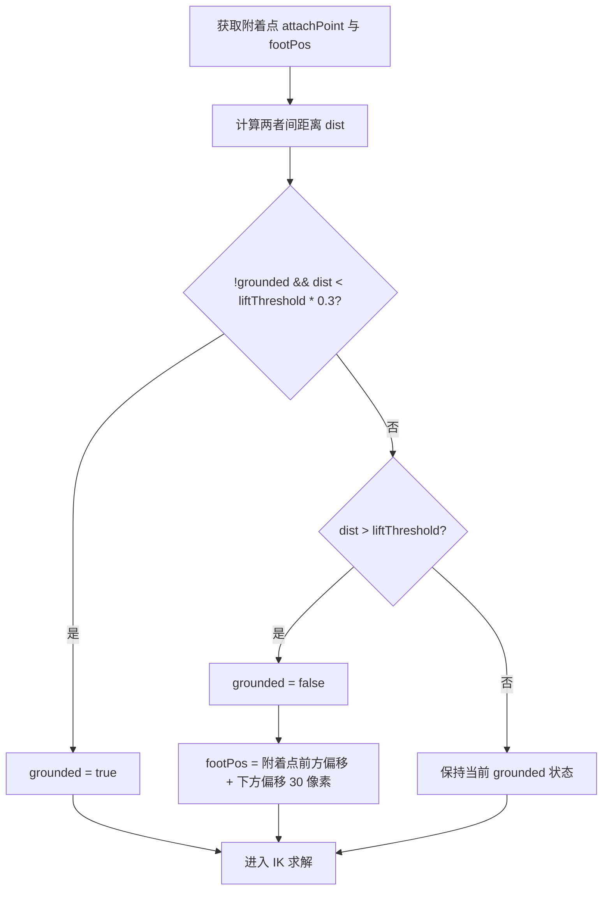
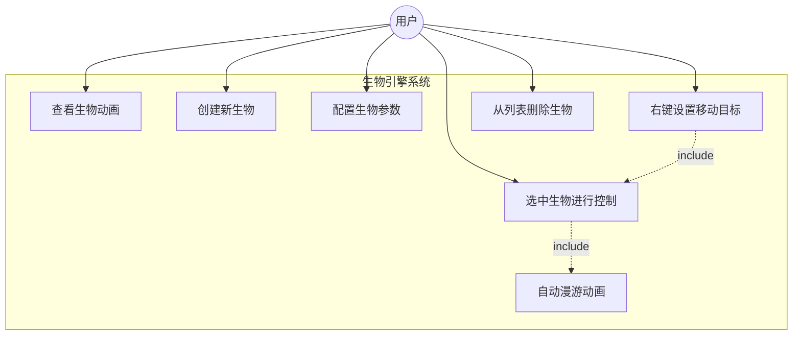
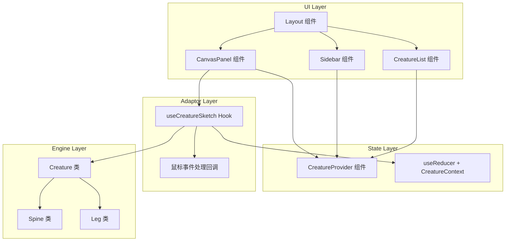
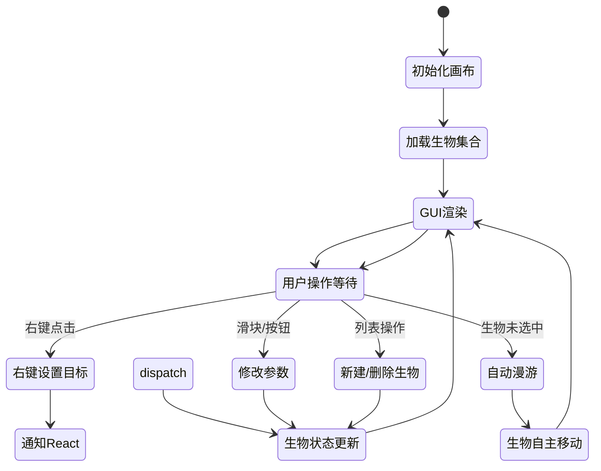
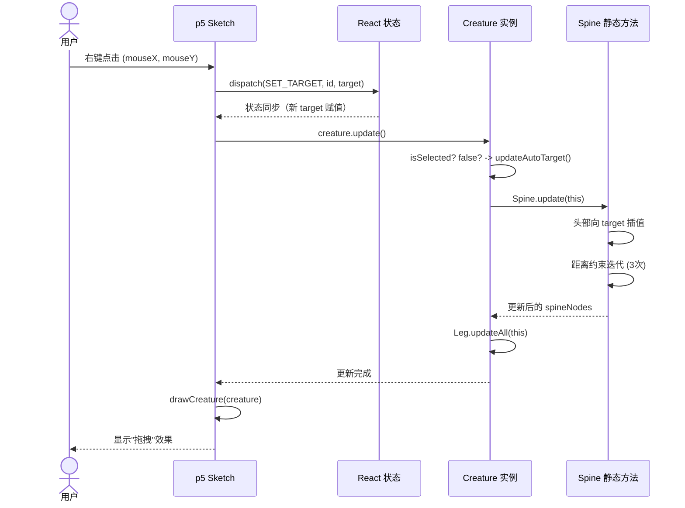
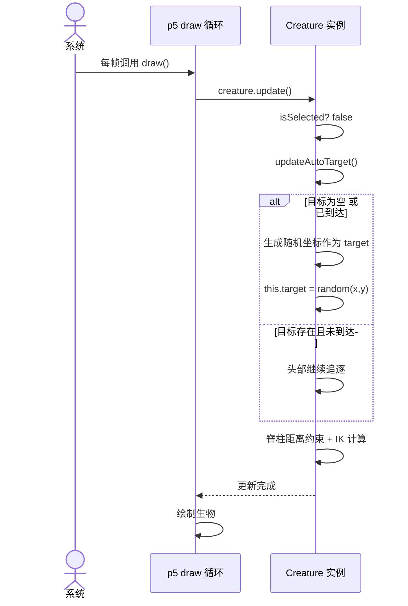

# 生物引擎（Bio-Engine）：程序化生物动画系统

## 基于 React 19 + p5.js 2026 版整合式架构

### 1. 技术栈与框架整合决策

#### 1.1 核心技术选型

* **前端框架**：React 19.x
* **编程语言**：TypeScript（严格模式，`strict: true`）
* **绘图与动画引擎**：p5.js（实例模式，Instance Mode），避免全局作用域污染，支持多画布同时运行
* **p5 集成组件**：@p5-wrapper/react ^5.0.3（核心组件已更名为 `<P5Canvas>`）
* **状态管理**：React Context + useReducer（提供时间旅行能力与简化调试）
* **样式方案**：Tailwind CSS 4.x（深色主题 UI）
* **构建工具**：Vite 6.x（对 React 快速刷新与 TypeScript 的开箱支持）

#### 1.2 框架整合模式确认

搜索结果显示，在 2026 年 React 应用中集成 p5.js 存在三种主流方案，均可在本项目中采用：

* **纯手写 wrapper 方案**。开发者利用 `useEffect` 与 `useRef` 钩子直接编写 p5.js 集成逻辑，实现 p5 实例的创建与销毁，以及与 React 生命周期的绑定。该方案对初学者友好，对所有行为的控制最为精细。

* **第三方组件库方案**。如 @p5-wrapper/react 和 @korkje/p5-react 等成熟组件，提供现成的组件包裹器，通过 sketch prop 将 p5 函数传递给组件，自动处理实例自动清理、Props 传递，以及 p.effect（类似 useEffect）的依赖监听。对于此类整合项目，推荐使用 @p5-wrapper/react，其拥有最活跃的维护状态和良好的 NextJS 兼容性（通过 @p5-wrapper/next 组件）。

* **@p5-wrapper/react v5 核心机制**。该组件接受一个 sketch prop（一个接收 p5 实例作为参数的函数），自动在内部管理实例的创建、挂载、卸载。v5 引入 `updater` prop，专门用于桥接 React 状态更新到 p5 生命周期，避免 React 状态泄露到 sketch 逻辑中。同时 v5 重构了内部类型系统，消除了所有 `as` 类型断言。

#### 1.3 选择决策与原因

对于当前"生物引擎"项目，采用 **@p5-wrapper/react ^5.0.0** 配合自定义 Hook 的组合方案：

* 利用 `<P5Canvas>` 组件自动完成 p5 实例生命周期管理，无需开发者手动实现重复逻辑。
* 通过 v5 的 `updater` prop 建立 React 状态到 p5 生命周期的单向数据桥，保证 sketch 逻辑纯净。
* 通过自定义 Hook（如 useCreatureSketch）将生物配置数据、状态更新逻辑、鼠标事件处理等封装为可复用的函数，与 React 组件解耦，实现清晰的分层架构。
* 该方案在保持开发者对动画逻辑的完全掌控的同时，最小化了框架间的版本冲突与破坏性更新风险。

### 2. 系统架构设计

#### 2.1 分层架构

系统按照分层架构设计，从界面层到底层引擎层依次划分为：

* **界面层（UI Layer）**。由 React 组件构成：UI 面板（左侧配置栏、右侧生物列表）以及画布容器（用于放置 `<P5Canvas>` 组件），负责用户输入、参数传递与列表展示。
* **状态管理层（State Layer）**。基于 React Context 与 useReducer 管理的全局不可变状态（生物集合、选中ID、配置参数），并通过闭包传递将状态变化同步至 p5 循环。
* **适配层（Adaptor Layer）**。React 端与 p5 端之间的桥梁：自定义 Hook（如 useCreatureSketch）负责将 React 状态转换为 p5 可识别的数据，而事件回调（如鼠标右键点击、列表选中）负责将 p5 交互信息通知给 React。
* **引擎层（Engine Layer）**。纯逻辑类，无任何框架依赖——Creature、Spine、Leg 等类，负责执行脊柱链式约束、IK 求解、自动目标生成等算法。

#### 2.2 项目文件结构

```text
src/
├── engine/              # 引擎层（纯逻辑，无框架依赖）
│   ├── Creature.ts      # 生物主体：数据聚合与行为编排
│   ├── Spine.ts         # 脊柱链式约束：距离约束求解、头部追逐
│   └── Leg.ts           # 反向运动学（IK）：二关节解析求解、贴地逻辑
├── state/               # 状态管理层
│   ├── CreatureContext.tsx  # Context Provider 与 Hook 导出
│   └── reducer.ts       # useReducer 纯函数 + Action 定义
├── hooks/               # 适配层
│   └── useCreatureSketch.ts  # 封装 sketch 函数与交互回调
├── components/          # 界面层
│   ├── Layout.tsx       # 三列布局容器
│   ├── CanvasPanel.tsx  # p5 画布容器（P5Canvas 包装）
│   ├── Sidebar.tsx      # 左侧配置面板（滑块、按钮、创建/删除）
│   └── CreatureList.tsx # 右侧生物列表（选中、删除）
├── types/               # 类型定义
│   └── creature.ts      # CreatureConfig、SpineNode 等共享类型
└── App.tsx              # 应用入口
```

#### 2.3 核心模块职责

| 模块 | 职责 | 技术栈 |
| --- | ------------------------------------------------------ | --- |
| **Layout 组件** | 整体布局分为三列：左侧配置栏、中央画布容器、右侧生物列表 | React + Tailwind CSS |
| **CanvasPanel 组件** | 容纳 `<P5Canvas>` 组件，将 React 状态传递为 sketch prop | React + @p5-wrapper/react v5 |
| **Sidebar 组件** | 左侧配置面板，包含滑块、按钮等控件 | React DOM |
| **CreatureList 组件** | 右侧生物列表，支持点击选中、删除生物 | React DOM |
| **CreatureContext** | 全局状态存储：生物集合、选中ID、默认配置参数 | React Context + useReducer |
| **useCreatureSketch Hook** | 自定义 Hook，将 React 状态、交互处理函数封装为 sketch 函数 | React Custom Hook |
| **p5 Sketch 函数** | 每帧调用的绘制循环，更新生物并渲染 | p5.js instance mode |
| **Creature 纯类** | 单个生物的所有数据与行为，不依赖 React 与 p5 | TypeScript |
| **Spine 纯类** | 脊柱链节点的距离约束求解、头部追逐目标 | TypeScript |
| **Leg 纯类** | 双腿反向运动学（IK）的解析求解、脚步贴地逻辑 | TypeScript |

### 3. 核心引擎设计（纯逻辑层）

#### 3.1 脊柱链式结构

* **节点定义**：每个脊柱节点包含当前帧的位置向量 `pos` 与上一帧位置向量 `prev`（用于未来扩展如惯性效果）。
* **初始化**：在画布中央生成水平排列的 N 个节点，每个节点间距为 `segLength`。
* **头部追逐行为**：头部节点以恒定速度 `speed` 值向目标点线性插值移动。当到达距离阈值（< 1 像素）时，头部固定于目标点。
* **距离约束求解**：从第二个节点开始，依次让节点 i 向节点 i-1 靠拢，保持两者间距离始终等于 segLength。该过程重复多次迭代（constraintIterations）以消除误差积累，实现平滑的"拖拽"效果。

#### 3.2 反向运动学（IK）肢体

* **骨骼模型**：每条腿由股骨段（长度 l1）和胫骨段（长度 l2）组成，附着在脊柱的特定节点（attachIndex）上。脚部固定于地面（footPos）。
* **抬脚检测**：每帧计算附着点与当前脚部位置的距离。若该距离超过 liftThreshold，则触发抬脚动作（grounded = false），下一帧在附着点前方的新位置重新落脚。
* **IK 求解**：采用二关节解析法（solve2JointIK）——根据附着点 A、脚目标位置 F、两段长度 l1 与 l2，计算中间关节 J 的坐标。当目标点超出骨骼总长时，将脚部约束在可到达范围内，防止关节反转。

#### 3.3 自动漫游行为

* **目标生成条件**：当生物 isSelected 为 false 且满足以下条件之一时，自动生成新目标：目标为空（null），或头部已到达当前目标（距离 < 2 像素）。
* **目标范围**：在画布内部的安全区域（autoTargetRange）内随机生成坐标点，确保生物不会触及边界或被裁剪。
* **选中生物**：当生物被选中后（isSelected = true），自动目标生成机制暂停，其运动完全由用户手动右键控制。

#### 3.4 脊柱距离约束算法流程

##### 3.4.1 算法概述

脊柱链由 N 个节点组成，每个节点持有当前位置向量 `pos` 与上一帧位置向量 `prev`。算法每帧执行两个阶段：头部追逐阶段和距离约束求解阶段。

##### 3.4.2 头部追逐阶段

头部节点（索引 0）每帧向目标 `target` 方向移动 `speed` 像素。移动方式为线性插值——计算头部到目标的方向向量，归一化后乘以速度值。当头部与目标距离小于 1 像素时，直接固定于目标坐标，停止移动。

```mermaid
flowchart TD
    A[获取目标 target] --> B{target 是否存在?}
    B -->|否| C[跳过本阶段]
    B -->|是| D[计算头部到目标的距离 dist]
    D --> E{dist < 1?}
    E -->|是| F[头部固定于 target]
    E -->|否| G[方向向量归一化]
    G --> H[头部位置 += 方向 * min(speed, dist)]
    H --> I[头部追逐完成]
    F --> I
    C --> I
```

##### 3.4.3 距离约束求解阶段

从索引 1 开始遍历所有节点，依次计算相邻两节点间的距离，若距离不等于 `segLength`，则沿连线方向将当前节点推移或拉近，使两者间距恢复为 `segLength`。该遍历过程重复执行 `constraintIterations` 次（推荐值为 3），以消除从头部向后累积的位置误差。

算法使用公式：`offset = (segLength - dist) / dist`，将当前节点位置沿连线方向修正 `offset` 比例。当 `dist` 为 0 时跳过该节点，避免除零异常。

```mermaid
flowchart TD
    A[初始化迭代计数器 iter = 0] --> B{iter < iterations?}
    B -->|否| Z[约束求解完成]
    B -->|是| C[初始化节点索引 i = 1]
    C --> D{i < nodes.length?}
    D -->|否| E[iter += 1]
    E --> B
    D -->|是| F[获取节点 i-1 与节点 i]
    F --> G[计算两者间距离 dist]
    G --> H{dist == 0?}
    H -->|是| I[跳过，避免除零]
    H -->|否| J[计算偏移比例 offset = (segLength - dist) / dist]
    J --> K[节点 i 位置 += 连线方向 * offset]
    K --> L[i += 1]
    I --> L
    L --> D
```

#### 3.5 反向运动学（IK）肢体算法流程

##### 3.5.1 算法概述

每条腿由两段骨骼组成：股骨（长度 l1）和胫骨（长度 l2），一端附着于脊柱节点（`attachIndex`），另一端落脚于地面（`footPos`）。算法每帧执行抬脚检测和 IK 求解两个阶段。

##### 3.5.2 抬脚检测

计算附着点当前位置与脚部当前位置的距离，若该距离超过 `liftThreshold`，则触发抬脚——将 `grounded` 标记设为 false，并将脚部重新落脚在附着点前方与下方偏移处的新坐标。当脚部与新附着点距离小于 `liftThreshold * 0.3` 时，将 `grounded` 重新标记为 true。



##### 3.5.3 二关节 IK 求解

根据附着点 A、脚部目标点 F、股骨长度 l1 和胫骨长度 l2，计算中间关节 J 的坐标。求解过程如下：

1. 计算 A 与 F 的距离 dist 和方向角 `angle = atan2(dy, dx)`。
2. 若 `dist >= l1 + l2`（目标超出骨骼总长），将脚部约束在骨骼最大可达范围内，中间关节取 A 与 F 方向的中点并向下偏移，防止关节反转。
3. 若 `dist < l1 + l2`，使用余弦定理计算夹角：`cosθ = (l1² + dist² - l2²) / (2 * l1 * dist)`，将 `cosθ` 钳制在 `[-1, 1]` 范围后取反余弦得到 θ。
4. 中间关节坐标为：`J = A + (cos(angle + θ) * l1, sin(angle + θ) * l1)`。

```mermaid
flowchart TD
    A[输入附着点 A, 脚目标 F, 长度 l1/l2] --> B[计算 dist 与 angle]
    B --> C{dist >= l1 + l2?}
    C -->|是| D[目标超出范围]
    D --> E[将脚约束在可达范围内]
    E --> F[中间关节 = A 与 F 中点 + 下偏移]
    C -->|否| G[cosθ = (l1² + dist² - l2²) / (2 * l1 * dist)]
    G --> H[钳制 cosθ 于 [-1, 1]]
    H --> I[θ = acos(cosθ)]
    I --> J[中间关节 J = A + (cos(angle+θ) * l1, sin(angle+θ) * l1)]
    F --> K[返回关节坐标与脚坐标]
    J --> K
```

#### 3.6 Creature 行为编排流程

每个 Creature 实例组合一个 Spine 对象与 N 个 Leg 对象，每帧执行以下完整流程：

```mermaid
flowchart TD
    A[Creature.update 每帧调用] --> B{isSelected?}
    B -->|是| C[使用用户设置的 target]
    B -->|否| D[updateAutoTarget: 自动生成随机目标]
    D --> E{target 为空 或 已到达?}
    E -->|是| F[在 autoTargetRange 内生成随机 target]
    E -->|否| G[保持当前 target]
    F --> H
    G --> H
    C --> H[Spine.update(target, speed)]
    H --> I[脊柱头部追逐]
    I --> J[脊柱距离约束迭代 3 次]
    J --> K[遍历所有 Leg.update]
    K --> L[抬脚检测]
    L --> M[IK 求解]
    M --> N[更新完成]
```

### 4. 状态管理与数据流

#### 4.1 全局状态定义

* **creatures**：CreatureConfig 对象数组，包含 id、spineCount、segLength、legCount、legSegments、speed、color、target、isSelected 等属性。
* **selectedId**：当前选中生物的 ID（字符串或 null）。
* **dispatch**：Reducer 的派发函数，支持以下 Action 类型：ADD_CREATURE、REMOVE_CREATURE、SELECT_CREATURE、SET_TARGET、UPDATE_CONFIG。

#### 4.2 从 React 到 p5 的数据流

* React 状态（生物集合、选中 ID）通过 @p5-wrapper/react 提供的 props 机制作为 sketch prop 传入 p5 sketch 函数。
* p5 内部使用 Creature 实例数组，并在每帧 draw 循环中调用每个 Creature 的 update 方法。当 React 状态变化时，p5 自动获取最新 props（通过 wrapper 内部机制或自定义同步函数）。
* 在创建 p5 sketch 函数时，通过闭包确保其能访问当前最新的 React 生物配置与选中状态。

#### 4.3 从 p5 到 React 的数据流

* 用户交互事件（如右键点击画布）在 p5 的 mousePressed 函数中触发，当检测到 selectedId 非空时，将目标坐标通过 dispatch 派发 SET_TARGET action 通知 React。
* React 更新生物状态后，新状态通过 wrapper 自动同步至 p5，实现闭环。

### 5. UML 图（Mermaid 描述）

#### 5.1 用例图（Use Case Diagram）



#### 5.2 组件图（Component Diagram）



#### 5.3 活动图（Activity Diagram）



#### 5.4 时序图（Sequence Diagram）：头部节点追逐目标点



#### 5.5 时序图（Sequence Diagram）：自动漫游目标生成



### 6. 关键交互机制描述

#### 6.1 手动控制交互

* **触发时机**：用户在画布区域执行右键点击操作。
* **响应流程**：
  * p5.js 的 mousePressed 事件函数检测鼠标按钮为 RIGHT 且 selectedId 非空。
  * 将鼠标坐标提取为目标点（target），通过 dispatch 派发 SET_TARGET action 通知给 React 状态层。
  * React 更新对应生物的 target 属性。
  * 更新后的状态自动通过 @p5-wrapper/react 的 props 机制同步至 p5 sketch。
  * 该生物在下一帧的 update 中，头部开始追逐新的目标点。
* **右键上下文阻止**：事件函数返回 false，阻止浏览器默认右键菜单弹出。

#### 6.2 选中生物的交互

* **选中方式一：右侧生物列表点击**。CreatureList 组件中，点击某个生物条目时，dispatch 派发 SELECT_CREATURE action 并传入其 ID。Reducer 将该生物的 isSelected 设为 true，并将 selectedId 更新为此 ID。
* **选中方式二（可选扩展）：画布上点击检测**。可在没有列表操作时，通过在 p5 mousePressed 中计算鼠标到各生物头部节点的距离，选择最近的生物作为当前选中对象。
* **高亮反馈**：被选中的生物在 p5 绘制循环中可显示额外的高亮轮廓或颜色变化，且右侧列表中该生物条目以加粗或蓝色高亮显示。

#### 6.3 参数调整的交互

* **操作入口**：左侧配置栏（Sidebar 组件）中的滑块与按钮（脊柱段数、体节长度、腿数量、颜色等参数）。
* **同步流程**：当用户调整滑块并点击"应用"按钮时，dispatch 派发 UPDATE_CONFIG action 更新当前选中生物的对应参数（spineCount、segLength、legCount 等）。新的参数通过 React 状态同步至 p5 端的 Creature 实例，实现动态形态调整。

#### 6.4 多生物协同管理

* **生物集合维护**：CreatureContext 中维护一个 CreatureConfig 数组，列表组件实时展示。支持添加新生物（每次创建一个带唯一 ID 的生物），删除已存在生物（同时释放 p5 中对应的 Creature 实例资源）。
* **自动漫游协同**：未被选中的所有生物各自独立执行自动目标生成与漫游移动，互不干扰，形成多生物同时在画布内蠕动探索的自然视觉效果。

### 7. 参数化设计原则

系统遵循彻底的参数化设计，所有核心行为均可通过配置灵活调整，无需修改核心逻辑代码。具体参数包括：

* **脊柱形态参数**：spineCount（椎节点总数，范围 3~30）、segLength（体节间距，范围 10~50 像素）。
* **腿部参数**：legCount（腿的数量，范围 0~8）、legSegments（股骨`[l1, l2]`长度数组，可独立调节）。
* **运动参数**：speed（头部追逐速度，范围 1~10 像素/帧）、constraintIterations（距离约束迭代次数，范围 2~5）、liftThreshold（抬腿检测距离阈值，范围 30~60 像素）。
* **视觉效果参数**：color（生物颜色，支持 `#ffffff` 格式的预设色板）、autoTargetRange（自动漫游范围，bounding box 四个坐标值）。

### 8. 性能优化策略

* **React 端优化**。通过 React.memo 包裹 CanvasPanel 组件以避免不必要的重渲染；将 useReducer 的 dispatch 单独传递而非传入整个 context value，防止无关组件收到状态更新。利用 useCallback 对自定义 Hook 中的交互处理函数（如鼠标点击回调）进行缓存，避免在每帧重新创建闭包。

* **p5 端优化**。在 draw 循环中避免频繁对象分配——生物节点的 Vec2 坐标可通过对象复用而非每帧新创建来降低 GC 压力。距离约束求解的迭代次数宜控制在 3~4 次以内，以获得最佳的平滑与性能折中。当生物数量超过 20 个时，采用对象池模式管理 Creature 实例生命周期。

* **内存管理**。在 REMOVE_CREATURE action 中同步清理 p5 sketch 中已删除 Creature 的引用，确保在组件卸载或生物删除时，没有任何悬挂的定时器、引用或事件监听器残留；利用 React 自动垃圾回收机制配合 useRef 管理 DOM 节点与 p5 实例，避免手动调用 remove() 导致引用丢失。

### 9. 测试与可扩展性

* **模块解耦带来的测试便利**。由于引擎层（Creature、Spine、Leg 类）与 UI 完全解耦，核心动画逻辑可通过 JavaScript 单元测试（如 Jest 与 Vitest）独立验证：包括脊柱节点的距离约束正确性、IK 关节角度输出的范围、目标追逐距离计算的误差容限等。

* **参数边界测试**。需覆盖边界场景以确保系统稳定性：如节点数为 2 时链式约束仍正常执行，腿数为 0 时不调用 IK 也不算崩溃，segLength 为 0 时应有防御性处理。

* **自动化回归测试**。React 组件同样可通过 React Testing Library 模拟用户操作（点击列表项、调节滑块），检测 dispatch 是否触发了正确的 Action。

* **未来扩展框架**。因引擎层纯类没有框架依赖，可轻松移植至其他前端框架（如 Vue 3 + Composition API，或 Svelte），仅需重新实现适配层（自定义Hook/函数）而无需修改核心算法。

### 10. 快速开始

#### 10.1 项目初始化

```bash
npm create vite@latest bio-engine -- --template react-ts
cd bio-engine
npm install @p5-wrapper/react@^5.0.3 p5
npm install -D tailwindcss @tailwindcss/vite
```

#### 10.2 样式配置

在 `tailwind.config.js` 中配置内容路径与深色主题色板（推荐 surface、panel、accent 三色系），在 `src/index.css` 中引入 Tailwind 基础指令并设置全局深色背景（`#0a0a0a`）与白色前景色。

#### 10.3 类型定义（src/types/creature.ts）

类型定义包含以下内容：

* **Vec2**：二维坐标结构，包含 `x` 与 `y` 两个数值字段，用于所有空间位置计算。
* **CreatureConfig**：生物配置接口，包含 `id`（唯一标识）、`spineCount`（脊柱节点数）、`segLength`（体节间距）、`legCount`（腿数量）、`legSegments`（股骨和胫骨长度元组）、`speed`（移动速度）、`color`（颜色字符串）、`target`（目标坐标或 null）、`isSelected`（是否选中）、`autoTargetRange`（自动漫游范围，四元素元组表示 bounding box）。
* **CreatureAction**：联合类型，覆盖五种操作——`ADD_CREATURE`（无参数）、`REMOVE_CREATURE`（传入 id）、`SELECT_CREATURE`（传入 id 或 null）、`SET_TARGET`（传入 id 和目标坐标）、`UPDATE_CONFIG`（传入 id 和配置局部对象）。

#### 10.4 核心使用流程

1. 创建新项目后，按 `2.2 项目文件结构` 建立目录
2. 在 `src/engine/` 下实现 `Spine.ts`、`Leg.ts`、`Creature.ts`（参考第 3 章算法描述）
3. 在 `src/state/` 下实现 `CreatureContext.tsx` 与 `reducer.ts`
4. 在 `src/hooks/` 下实现 `useCreatureSketch.ts`，返回 `<P5Canvas>` 所需的 `sketch` 函数与 `updater`
5. 在 `src/components/` 下实现 `Layout`、`CanvasPanel`、`Sidebar`、`CreatureList`
6. 运行 `npm run dev` 启动开发服务器

### 11. 总结

本工程文档详细阐述了如何在 React 19 生态中利用 p5.js instance mode 构建程序化生物动画系统。通过在 UI 层与引擎层之间建立清晰的适配层，实现 React 声明式状态管理与 p5 命令式动画循环的和谐共生。系统采用高度参数化与模块化设计，支持多生物并行管理、手动操控与自主漫游，为游戏、艺术装置及教育演示提供可扩展的底层工具原型。基于 2026 年框架最佳实践的整合策略，确保了技术选型的前瞻性与长期可维护性。
