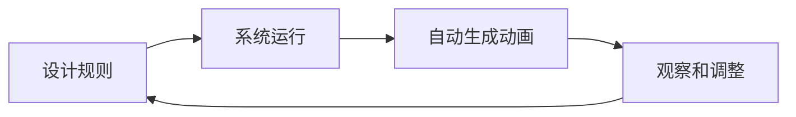

# 核心概念

理解这些核心思想，帮助你更好地设计和实现程序化动画。

---

## 什么是程序化动画？

程序化动画不是画好每一帧，而是**定义规则**，让系统按照这些规则自动生成动画。

核心思想：
- 你是"规则设计者"，不是"动画师"
- 你设定参数和算法，系统负责表演
- 可以创造无限的变化，每次运行都可能不同

---

## 链式跟随：一条链子的启示

想象一条项链，你抓住一端移动，其他部分会自然跟随。

### 核心思想
- 一个物体的运动影响下一个物体
- 每个部分保持与前面部分的关系
- 整体形成连贯的运动

### 可探索的变体
- **距离约束**：节段之间保持固定距离
- **角度限制**：节段不能弯曲超过某个角度
- **弹性连接**：节段之间有弹性，距离可以变化
- **惯性影响**：节段有质量和惯性
- **多向跟随**：节段同时受多个邻居影响

### 生活中的类比
- 蛇的爬行
- 火车车厢的连接
- 绳索的摆动
- 水流的流动

---

## 反向运动学：从目标倒推

想象你想让手碰到某个东西，你的大脑会自动计算肩膀、肘部、手腕需要怎么动。

### 核心思想
- 从想要的结果（末端位置）倒推
- 计算各个关节应该在什么位置
- 处理多种可能的解决方案

### 可探索的变体
- **二关节 IK**：最基础的解析解
- **多关节 IK**：用数值迭代方法求解
- **关节限制**：关节不能超过自然的活动范围
- **优先级 IK**：某些目标更重要
- **平滑过渡**：目标变化时自然过渡

### 生活中的类比
- 伸手取物
- 脚在地面上的位置
- 蜘蛛在复杂地形的移动
- 猫科动物的优雅步态

---

## 行为系统：赋予"生命"

生物不应该只是机械地运动，它应该有"想要做什么"的意图。

### 核心思想
- 生物有状态（放松、紧张、好奇等）
- 生物有目标（去哪里、做什么）
- 状态和目标影响行为方式
- 可以从一种状态平滑过渡到另一种

### 可探索的状态模型
- **状态机**：有限的离散状态，条件触发切换
- **行为树**：树形结构组织行为逻辑
- **效用系统**：评估多个选项，选择效用最高的
- **神经网络**：学习和适应（进阶）

### 可探索的行为设计
- **目标选择**：为什么选这个目标而不是那个
- **路径规划**：怎么到达目标
- **障碍避让**：遇到东西怎么办
- **社交互动**：多个生物之间怎么互动

---

## 物理模拟：感受世界

给生物添加一些物理特性，让它的运动更自然。

### 可加入的物理概念
- **质量和惯性**：物体会保持当前运动状态
- **摩擦和阻尼**：运动会慢慢停下来
- **碰撞和反弹**：遇到东西会弹开
- **重力**：物体有"下落"的趋势
- **弹簧和弹性**：连接有弹性

### 物理模拟的层次
- **完全物理驱动**：生物完全受物理定律控制
- **半物理**：关键部分用物理，其他部分用算法
- **物理风格**：看起来像有物理，但不是真的模拟

---

## 参数化设计：一切可调

把生物的各种特性变成可调节的参数，探索无限组合。

### 参数的类型
- **形态参数**：节段数量、长度、粗细、颜色
- **运动参数**：速度、加速度、灵活度
- **行为参数**：好奇心、胆量、社交性
- **物理参数**：质量、弹性、摩擦

### 参数设计的乐趣
- **预设系统**：保存有趣的参数组合
- **随机生成**：随机组合参数，发现惊喜
- **参数动画**：参数本身也可以随时间变化
- **响应参数**：参数根据环境动态调整

---

## 渲染：视觉表达

最后，用代码把生物画出来，赋予它视觉个性。

### 可探索的渲染风格
- **几何绘制**：圆形、线条、多边形等基本图形
- **程序纹理**：用代码生成纹理和图案
- **粒子系统**：用粒子增加视觉丰富度
- **着色器**：进阶的图形编程（如果平台支持）

### 视觉细节
- **轮廓和描边**：让生物的轮廓更清晰
- **内部细节**：添加斑点、条纹、纹理等
- **光影效果**：让生物有体积感
- **动态变化**：视觉随生物状态变化

---

## 系统思维：整体设计

思考你的整个系统是如何组织的。

### 关注点分离
- **引擎层**：纯算法和逻辑，没有外部依赖
- **状态层**：管理数据和状态变化
- **适配层**：连接引擎和 UI
- **界面层**：用户看到和交互的部分

### 数据流动
- **单向数据流**：数据清晰地从一个地方流到另一个地方
- **状态不变性**：不直接修改数据，而是创建新数据
- **事件驱动**：动作和反应分离

---

## 迭代开发：边做边改

程序化动画最适合迭代式开发。

### 工作流程
1. 实现一个简单版本，让它先跑起来
2. 观察它的行为，思考哪些地方有趣，哪些地方可以更好
3. 调整算法和参数，看看有什么变化
4. 重复这个过程

### 在"错误"中发现
- 算法出错可能产生意外的有趣效果
- 参数设得太极端可能发现新的表现形式
- 把"bug"变成"特色"

---

记住：这些都只是思考工具，不是束缚！

理解核心概念后，你可以自由组合、混搭、完全创造新的方法。
