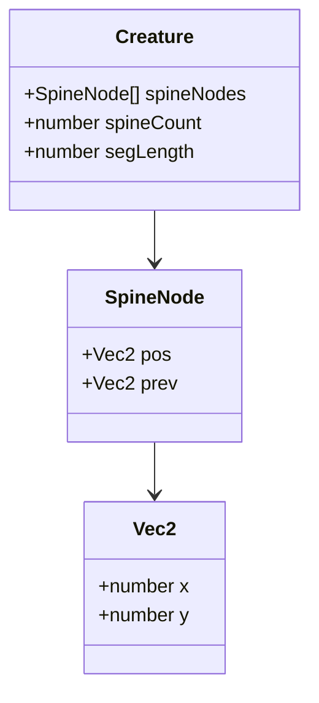
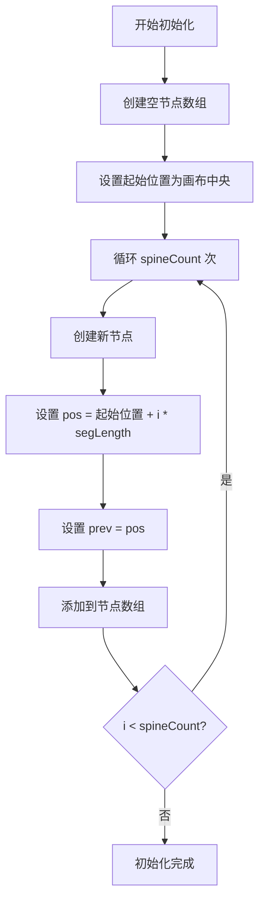

# 核心引擎设计 - 脊柱链式结构

## 1. 算法概述

脊柱链式结构是程序化生物运动的核心算法之一，用于模拟生物脊柱的柔性和拖拽效果。该算法通过距离约束求解和头部追逐行为，实现平滑的链式跟随动画。

## 2. 节点数据结构

### 2.1 脊柱节点定义

每个脊柱节点包含以下属性：

| 属性 | 类型 | 说明 |
| --- | --- | --- |
| pos | Vec2 | 当前帧位置向量，包含 x 和 y 两个数值字段 |
| prev | Vec2 | 上一帧位置向量，用于未来扩展如惯性效果 |

### 2.2 Vec2 坐标结构



**数据结构说明**：

- Vec2 是基础二维坐标结构
- SpineNode 继承或组合 Vec2 用于位置存储
- Creature 聚合多个 SpineNode 形成脊柱链

## 3. 初始化流程

### 3.1 节点生成算法



**初始化参数**：

- **spineCount**：脊柱节点总数，范围 3~30
- **segLength**：体节间距，范围 10~50 像素
- **起始位置**：画布中央坐标 (width/2, height/2)

### 3.2 水平排列策略

节点在画布中央水平排列，每个节点间距为 segLength：

- 第一个节点（头部）位于画布中心
- 后续节点依次向右排列
- 形成初始的水平脊柱链

## 4. 头部追逐行为

### 4.1 算法原理

头部节点（索引 0）每帧向目标点 target 方向移动 speed 像素，移动方式为线性插值。

### 4.2 详细流程图

```mermaid
flowchart TD
    A[获取目标点 target] --> B{target 是否存在?}
    B -->|否| C[跳过本阶段]
    B -->|是| D[计算头部到目标的距离 dist]
    D --> E{dist < 1?}
    E -->|是| F[头部固定于 target]
    E -->|否| G[计算方向向量 dir = target - head.pos]
    G --> H[归一化方向向量 dir = dir / dist]
    H --> I[移动距离 moveDist = min(speed, dist)]
    I --> J[头部位置 head.pos += dir * moveDist]
    J --> K[头部追逐完成]
    F --> K
    C --> K
```

### 4.3 算法细节

#### 4.3.1 方向向量计算

```text
方向向量 dir = (target.x - head.pos.x, target.y - head.pos.y)
距离 dist = sqrt(dir.x² + dir.y²)
归一化 dir = (dir.x / dist, dir.y / dist)
```

#### 4.3.2 移动距离计算

```text
移动距离 moveDist = min(speed, dist)
新位置 head.pos = (head.pos.x + dir.x * moveDist, head.pos.y + dir.y * moveDist)
```

#### 4.3.3 到达判定

```text
如果 dist < 1 像素：
    head.pos = target
    停止移动
```

### 4.4 参数说明

| 参数 | 类型 | 范围 | 说明 |
| --- | --- | --- | --- |
| speed | number | 1~10 | 头部追逐速度，单位像素/帧 |
| target | Vec2 \| null | - | 目标点坐标，为空时不移动 |
| 到达阈值 | number | 固定值 1 | 距离小于此值时判定为到达 |

## 5. 距离约束求解

### 5.1 算法原理

从第二个节点（索引 1）开始，依次让节点 i 向节点 i-1 靠拢，保持两者间距离始终等于 segLength。该过程重复多次迭代以消除误差积累。

### 5.2 详细流程图

```mermaid
flowchart TD
    A[初始化迭代计数器 iter = 0] --> B{iter < iterations?}
    B -->|否| Z[约束求解完成]
    B -->|是| C[初始化节点索引 i = 1]
    C --> D{i < nodes.length?}
    D -->|否| E[iter += 1]
    E --> B
    D -->|是| F[获取节点 i-1 与节点 i]
    F --> G[计算向量 diff = node[i].pos - node[i-1].pos]
    G --> H[计算距离 dist = |diff|]
    H --> I{dist == 0?}
    I -->|是| J[跳过，避免除零]
    I -->|否| K[计算偏移比例 offset = (segLength - dist) / dist]
    K --> L[节点 i 位置 += diff * offset]
    L --> M[i += 1]
    J --> M
    M --> D
```

### 5.3 算法公式

#### 5.3.1 距离计算

```text
diff = (node[i].pos.x - node[i-1].pos.x, node[i].pos.y - node[i-1].pos.y)
dist = sqrt(diff.x² + diff.y²)
```

#### 5.3.2 偏移计算

```text
如果 dist == 0：
    跳过该节点（避免除零异常）
否则：
    offset = (segLength - dist) / dist
    node[i].pos.x += diff.x * offset
    node[i].pos.y += diff.y * offset
```

### 5.4 迭代次数说明

| 迭代次数 | 效果 | 性能 |
| --- | --- | --- |
| 1 次 | 基本约束，误差较大 | 最优 |
| 2 次 | 较好约束，轻微误差 | 良好 |
| 3 次 | 平滑约束，误差小（推荐） | 平衡 |
| 4 次 | 极佳约束，几乎无误差 | 稍慢 |
| 5 次以上 | 边际收益递减 | 不推荐 |

**推荐值**：constraintIterations = 3，在平滑性和性能之间取得最佳平衡

## 6. Creature 行为编排 - 脊柱部分

### 6.1 每帧更新流程

```mermaid
flowchart TD
    A[Creature.update 每帧调用] --> B{isSelected?}
    B -->|是| C[使用用户设置的 target]
    B -->|否| D[updateAutoTarget: 自动生成随机目标]
    D --> E{target 为空 或 已到达?}
    E -->|是| F[在 autoTargetRange 内生成随机 target]
    E -->|否| G[保持当前 target]
    F --> H
    G --> H
    C --> H[Spine.update(target, speed)]
    H --> I[脊柱头部追逐目标点]
    I --> J[脊柱距离约束迭代 constraintIterations 次]
    J --> K[脊柱更新完成]
```

### 6.2 Spine 类职责

| 方法 | 输入 | 输出 | 说明 |
| --- | --- | --- | --- |
| update(target, speed) | 目标点、速度 | 无 | 执行头部追逐和距离约束 |
| initialize(count, segLength, startPos) | 节点数、间距、起始位置 | 无 | 初始化脊柱节点数组 |
| solveConstraints(iterations) | 迭代次数 | 无 | 执行距离约束求解 |
| chaseHead(target, speed) | 目标点、速度 | 无 | 执行头部追逐行为 |

## 7. 边界条件处理

### 7.1 节点数边界

| 情况 | 处理方式 |
| --- | --- |
| spineCount < 2 | 至少需要 2 个节点才能形成链，小于 2 时抛出异常 |
| spineCount = 2 | 最小有效链，头部 + 1 个跟随节点 |
| spineCount > 30 | 超过 30 个节点性能下降，建议限制最大值 |

### 7.2 距离边界

| 情况 | 处理方式 |
| --- | --- |
| segLength = 0 | 无效参数，抛出异常 |
| segLength < 10 | 节点过于密集，视觉效果差，建议最小值 10 |
| segLength > 50 | 节点过于稀疏，链式效果不明显，建议最大值 50 |

### 7.3 除零保护

在距离约束求解中，当两个节点重合时（dist = 0），必须跳过该节点避免除零异常：

在距离约束求解中，当两个节点重合时（dist = 0），必须跳过该节点避免除零异常：

```text
如果 dist == 0：
    跳过当前节点，处理下一个节点
```

## 8. 算法复杂度分析

### 8.1 时间复杂度

| 操作 | 复杂度 | 说明 |
| --- | --- | --- |
| 头部追逐 | O(1) | 只处理单个节点 |
| 单次约束求解 | O(n) | 遍历 n-1 个节点 |
| 完整约束求解 | O(n * k) | n 为节点数，k 为迭代次数 |
| 每帧总开销 | O(n * k) | 头部追逐 + 约束求解 |

### 8.2 空间复杂度

| 数据结构 | 复杂度 | 说明 |
| --- | --- | --- |
| 节点数组 | O(n) | 存储 n 个脊柱节点 |
| 每节点开销 | O(1) | 每个节点包含 pos 和 prev |
| 总空间开销 | O(n) | 与节点数成正比 |

## 9. 算法优化建议

### 9.1 性能优化

| 优化项 | 方法 | 效果 |
| --- | --- | --- |
| 迭代次数 | 控制在 3 次以内 | 减少计算量 |
| 对象复用 | 复用 Vec2 对象而非每帧创建 | 降低 GC 压力 |
| 提前终止 | dist < 1 时停止追逐 | 避免无效计算 |

### 9.2 精度优化

| 优化项 | 方法 | 效果 |
| --- | --- | --- |
| 增加迭代 | 提高到 4-5 次 | 约束更精确 |
| 减小 segLength | 使用更小的体节间距 | 链式更平滑 |
| 惯性扩展 | 使用 prev 字段添加惯性 | 运动更自然 |

## 10. 测试用例设计

### 10.1 基础功能测试

| 测试项 | 输入 | 预期输出 |
| --- | --- | --- |
| 初始化 | spineCount=5, segLength=20 | 5 个节点水平排列，间距 20 像素 |
| 头部追逐 | target=(100, 100), speed=5 | 头部向 (100, 100) 移动，每帧最多 5 像素 |
| 到达判定 | target=(100, 100), dist=0.5 | 头部固定在 (100, 100) |
| 约束求解 | 节点被拖动 | 节点间距恢复为 segLength |

### 10.2 边界条件测试

| 测试项 | 输入 | 预期输出 |
| --- | --- | --- |
| 最小节点数 | spineCount=2 | 正常初始化 |
| 零间距 | segLength=0 | 抛出异常 |
| 空目标 | target=null | 跳过头部追逐 |
| 节点重合 | 两节点位置相同 | 跳过该节点，不崩溃 |
