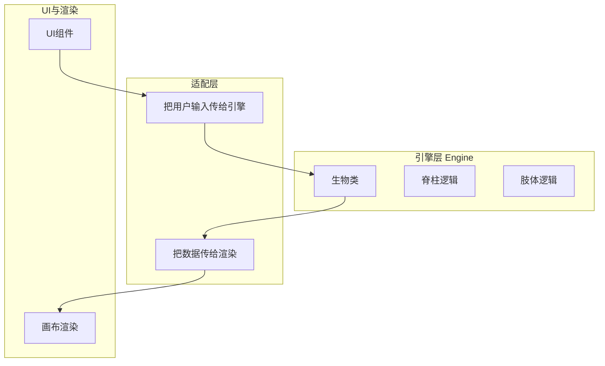
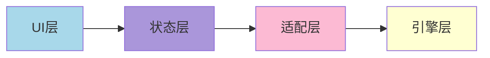
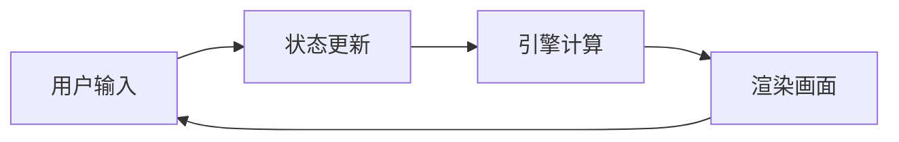

# 架构参考

这里提供几种可选的架构模式，帮助你组织代码。没有"正确答案"，选择适合你项目规模和复杂度的方式。

---

## 架构的目标

好的架构帮助你：
- 把相关的代码组织在一起
- 让代码更容易修改和扩展
- 让引擎逻辑可以复用（比如移植到其他框架）
- 让多人协作更容易

---

## 模式 A：简单单体（适合小项目）

所有代码混在一起，快速上手。

```
项目
├── 主程序
│   ├── 生物数据结构
│   ├── 生物更新逻辑
│   ├── 渲染逻辑
│   └── 交互处理
└── UI 组件
```

**适用场景**：
- 单人小项目
- 快速原型验证
- 想要简单直接的方式

**优点**：
- 简单，容易理解
- 快速上手
- 没有抽象开销

**缺点**：
- 代码多了会混乱
- 难以复用
- 修改容易影响多个地方

---

## 模式 B：引擎与渲染分离（推荐）

把核心算法和渲染、框架分开。



**适用场景**：
- 想要引擎逻辑可复用
- 可能换渲染技术（比如从 p5 换成 Canvas API）
- 想要引擎可以单独测试

**优点**：
- 引擎没有外部依赖，很干净
- 可以单独测试引擎逻辑
- 容易移植到其他框架

**如何做**：
- 引擎层只做计算，不调用任何绘图 API
- 引擎只通过参数接收数据，通过返回值输出数据
- 渲染层负责把引擎的结果画出来

---

## 模式 C：分层架构（中等复杂度）

更细致的职责划分。



**各层职责**：

- **UI 层**：用户看到和点击的东西
  - 按钮、滑块、画布
  - 响应用户输入

- **状态层**：管理所有数据
  - 当前有哪些生物
  - 每个生物的参数
  - 用户选中了谁

- **适配层**：中间桥梁
  - 把状态传给引擎
  - 把引擎更新后的数据传回状态
  - 处理用户输入并转化为操作

- **引擎层**：纯算法逻辑
  - 脊柱和肢体的计算
  - 行为和漫游逻辑
  - 没有外部依赖

**适用场景**：
- 项目有一定复杂度
- 多人协作
- 想要清晰的职责划分

**优点**：
- 职责清晰，代码好找
- 每层可以独立演进
- 方便测试

---

## 模式 D：数据驱动（灵活配置）

一切都是数据，行为由数据描述。

```
生物配置 = {
  脊柱节段: 10,
  节段长度: 20,
  肢体数量: 4,
  速度: 5,
  颜色: #ffffff,
  ...更多参数
}

渲染器读取配置并绘制
更新器读取配置并计算下一帧
```

**适用场景**：
- 想要高度可配置
- 想要预设系统（保存/加载不同配置）
- 想要动态改变生物形态

**优点**：
- 配置和逻辑分离
- 容易实现预设、存档
- 参数可以序列化

---

## 模式 E：实体组件（ECS 风格）

把生物拆成不同的组件组合。

```
实体 = {
  id: 生物1,
  组件: [
    位置组件,
    脊柱组件,
    肢体组件,
    行为组件,
    渲染组件
  ]
}

系统 = [
  运动系统: 处理所有位置组件,
  渲染系统: 处理所有渲染组件,
  ...
]
```

**适用场景**：
- 生物种类很多，差异很大
- 想要灵活组合不同功能
- 游戏开发背景

**优点**：
- 组合灵活
- 容易添加新功能
- 可以优化批量处理

**缺点**：
- 对于小项目可能过度设计
- 概念较复杂

---

## 数据流动的几种方式

### 方式 A：单向数据流

数据从一个方向流到另一个方向，不回头。



**优点**：可追踪，好调试

---

### 方式 B：事件驱动

发生什么事就发出事件，关心的部分响应。

```
用户点击 → "目标设置"事件 → 生物接收事件 → 更新目标
参数改变 → "配置更新"事件 → 生物接收事件 → 应用新配置
```

**优点**：解耦，灵活

---

### 方式 C：观察者模式

数据变化时自动通知依赖者。

```
生物位置变化 → 自动通知渲染器 → 渲染器更新画面
```

**优点**：响应式，自动更新

---

## 选择建议

### 刚开始，试试简单的
- 先用模式 A 或 B
- 让东西先跑起来
- 有需要了再重构

### 项目成长时
- 当你发现代码混在一起不好改时
- 当你想加新功能却不敢动旧代码时
- 当你想把某些逻辑用在别处时
→ 可以考虑更细致的架构

### 记住：可以演进
架构不是一开始就要完美的，随着项目发展可以重构和调整。

---

## 反模式（避免这些）

### 把所有逻辑塞在渲染循环里
```
draw() {
  // 这里做了所有事情：计算、更新、渲染...
}
```
→ 分开更新和渲染

### 引擎层直接调用绘图 API
```
class 生物 {
  update() {
    drawCircle() // 不好！引擎不应该知道渲染
  }
}
```
→ 引擎只计算，渲染层负责画

### 全局变量满天飞
```
let 当前选中生物
let 所有生物列表
let 画布宽度
...
```
→ 用状态管理把它们组织起来

---

最后：这些都是参考，不是规矩！

选择最适合你项目的方式，或者混搭，或者完全自创。
