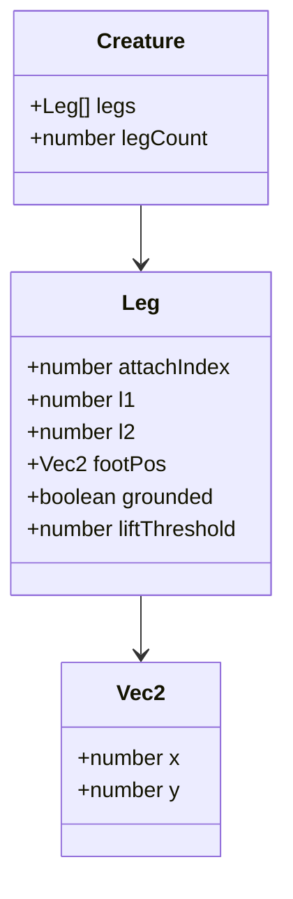
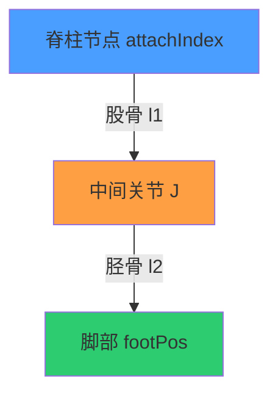
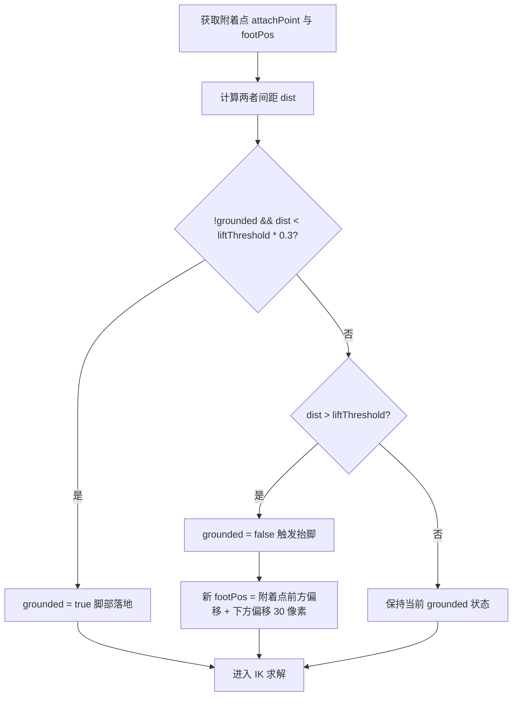
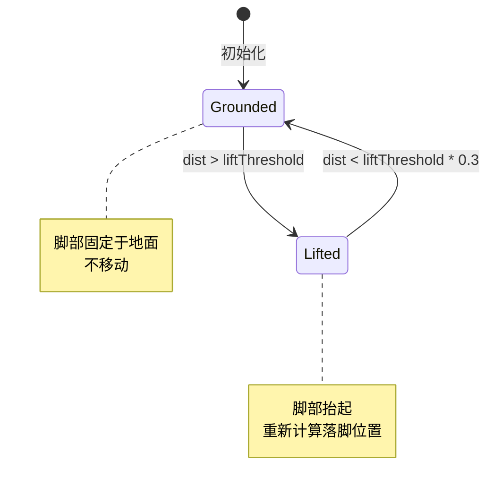
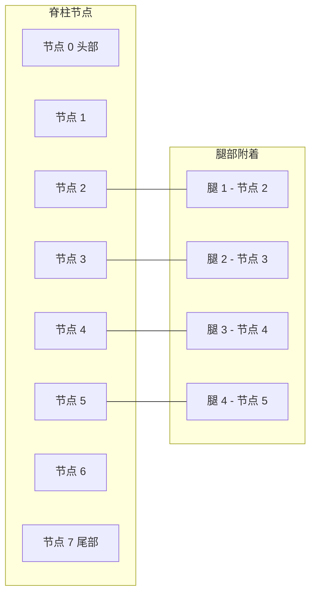

# 核心引擎设计 - 反向运动学（IK）肢体

## 1. 算法概述

反向运动学（Inverse Kinematics, IK）用于计算生物肢体的关节角度，使脚部能够准确落脚于目标位置。本系统采用二关节解析法求解，每条腿由股骨和胫骨两段骨骼组成。

## 2. 骨骼模型

### 2.1 腿部结构



### 2.2 腿部属性定义

| 属性 | 类型 | 说明 |
| --- | --- | --- |
| attachIndex | number | 附着点在脊柱节点数组中的索引 |
| l1 | number | 股骨段长度 |
| l2 | number | 胫骨段长度 |
| footPos | Vec2 | 脚部当前位置 |
| grounded | boolean | 脚部是否着地 |
| liftThreshold | number | 抬脚检测距离阈值 |

### 2.3 骨骼连接示意



## 3. 抬脚检测机制

### 3.1 检测原理

每帧计算附着点与当前脚部位置的距离，根据距离判断是否需要抬脚。

### 3.2 详细流程图



### 3.3 状态转换图



### 3.4 参数说明

| 参数 | 类型 | 范围 | 说明 |
| --- | --- | --- | --- |
| liftThreshold | number | 30~60 | 抬脚检测距离阈值，单位像素 |
| 落地阈值 | number | liftThreshold *0.3 | 脚部与附着点距离小于此值时判定为落地 |
| 下方偏移 | number | 固定值 30 | 新落脚位置在附着点下方的偏移量 |

## 4. 二关节 IK 求解

### 4.1 算法原理

根据附着点 A、脚部目标点 F、股骨长度 l1 和胫骨长度 l2，计算中间关节 J 的坐标。

### 4.2 详细流程图

```mermaid
flowchart TD
    A[输入附着点 A, 脚目标 F, 长度 l1/l2] --> B[计算 A 到 F 的距离 dist 和方向角 angle = atan2(dy, dx)]
    B --> C{dist >= l1 + l2?}
    C -->|是| D[目标超出骨骼总长]
    D --> E[将脚约束在可达范围内]
    E --> F[中间关节 = A 到 F 中点 + 下偏移]
    C -->|否| G[cosθ = (l1² + dist² - l2²) / (2 * l1 * dist)]
    G --> H[钳制 cosθ 到 [-1, 1]]
    H --> I[θ = acos(cosθ)]
    I --> J[中间关节 J = A + (cos(angle+θ) * l1, sin(angle+θ) * l1)]
    J --> K[返回关节坐标与脚坐标]
```

### 4.3 算法公式

#### 4.3.1 距离和角度计算

```text
dx = F.x - A.x
dy = F.y - A.y
dist = sqrt(dx² + dy²)
angle = atan2(dy, dx)
```

#### 4.3.2 超出范围处理

```text
如果 dist >= l1 + l2：
    F.x = A.x + dx / dist * (l1 + l2 - 0.001)
    F.y = A.y + dy / dist * (l1 + l2 - 0.001)
    J.x = (A.x + F.x) / 2
    J.y = (A.y + F.y) / 2 + 下偏移
```

#### 4.3.3 余弦定理求解

```text
如果 dist < l1 + l2：
    cosθ = (l1² + dist² - l2²) / (2 * l1 * dist)
    cosθ = clamp(cosθ, -1, 1)
    θ = acos(cosθ)
    J.x = A.x + cos(angle + θ) * l1
    J.y = A.y + sin(angle + θ) * l1
```

### 4.4 钳制处理

使用 clamp 函数将 cosθ 限制在 [-1, 1] 范围内，防止浮点误差导致 acos 返回 NaN：

使用 clamp 函数将 cosθ 限制在 [-1, 1] 范围内，防止浮点误差导致 acos 返回 NaN：

```text
clamp(value, min, max) = max(min, min(value, max))
```

## 5. Leg 类职责

### 5.1 方法定义

| 方法 | 输入 | 输出 | 说明 |
| --- | --- | --- | --- |
| update(attachPoint) | 附着点坐标 | 无 | 执行抬脚检测和 IK 求解 |
| checkLift(attachPoint) | 附着点坐标 | boolean | 判断是否需要抬脚 |
| solve2JointIK(A, F, l1, l2) | 附着点、脚目标、骨骼长度 | 中间关节坐标 | 二关节 IK 求解 |
| repositionFoot(attachPoint) | 附着点坐标 | 新 footPos | 计算新的落脚位置 |

### 5.2 每帧更新流程

```mermaid
flowchart TD
    A[Leg.update 调用] --> B[获取附着点 attachPoint]
    B --> C[checkLift(attachPoint)]
    C --> D{需要抬脚?}
    D -->|是| E[grounded = false]
    E --> F[repositionFoot(attachPoint)]
    D -->|否| G{需要落地?}
    G -->|是| H[grounded = true]
    G -->|否| I[保持状态]
    F --> J
    H --> J
    I --> J[solve2JointIK(attachPoint, footPos, l1, l2)]
    J --> K[更新关节坐标]
    K --> L[绘制腿部]
```

## 6. 多腿协同

### 6.1 腿部附着点分布



### 6.2 腿部数量限制

| legCount | 说明 |
| --- | --- |
| 0 | 无腿部，不调用 IK 算法 |
| 1~4 | 常见配置，性能良好 |
| 5~8 | 多足生物，性能消耗增加 |
| >8 | 不推荐，视觉效果不自然 |

## 7. 边界条件处理

### 7.1 骨骼长度边界

| 情况 | 处理方式 |
| --- | --- |
| l1 + l2 <= 0 | 无效参数，抛出异常 |
| l1 或 l2 < 5 | 骨骼过短，视觉效果差，建议最小值 5 |
| l1 或 l2 > 100 | 骨骼过长，可能导致关节反转，建议最大值 100 |

### 7.2 抬脚阈值边界

| 情况 | 处理方式 |
| --- | --- |
| liftThreshold < 10 | 过于敏感，频繁抬脚，建议最小值 10 |
| liftThreshold > 100 | 过于迟钝，腿部拖拽，建议最大值 100 |

### 7.3 附着点边界

| 情况 | 处理方式 |
| --- | --- |
| attachIndex < 0 | 无效索引，抛出异常 |
| attachIndex >= spineCount | 超出脊柱范围，抛出异常 |

## 8. 算法复杂度分析

### 8.1 时间复杂度

| 操作 | 复杂度 | 说明 |
| --- | --- | --- |
| 抬脚检测 | O(1) | 简单距离计算 |
| IK 求解 | O(1) | 固定次数的数学运算 |
| 单腿更新 | O(1) | 抬脚检测 + IK 求解 |
| 所有腿更新 | O(m) | m 为腿部数量 |

### 8.2 空间复杂度

| 数据结构 | 复杂度 | 说明 |
| --- | --- | --- |
| 腿部数组 | O(m) | 存储 m 个腿部对象 |
| 每腿开销 | O(1) | 固定属性数量 |
| 总空间开销 | O(m) | 与腿部数量成正比 |

## 9. 算法优化建议

### 9.1 性能优化

| 优化项 | 方法 | 效果 |
| --- | --- | --- |
| 提前返回 | grounded 且无需抬脚时跳过 IK | 减少计算量 |
| 对象复用 | 复用 Vec2 对象 | 降低 GC 压力 |
| 查表优化 | 预计算常用三角函数值 | 加速求解（可选） |

### 9.2 视觉效果优化

| 优化项 | 方法 | 效果 |
| --- | --- | --- |
| 交替抬脚 | 左右腿交替抬脚 | 更自然的步态 |
| 惯性缓冲 | 添加脚部移动惯性 | 更平滑的运动 |
| 地面检测 | 根据地形调整 footPos.y | 适应复杂地形 |

## 10. 测试用例设计

### 10.1 基础功能测试

| 测试项 | 输入 | 预期输出 |
| --- | --- | --- |
| 初始化 | l1=20, l2=15, attachIndex=2 | 腿部正常初始化 |
| 抬脚检测 | dist=45, liftThreshold=30 | grounded = false |
| 落地检测 | dist=5, liftThreshold=30 | grounded = true |
| IK 求解 | A=(0,0), F=(30,0), l1=20, l2=15 | 计算中间关节坐标 |

### 10.2 边界条件测试

| 测试项 | 输入 | 预期输出 |
| --- | --- | --- |
| 零骨骼长度 | l1=0, l2=0 | 抛出异常 |
| 超出范围 | dist >= l1 + l2 | 脚部约束在可达范围内 |
| 浮点误差 | cosθ = 1.0001 | 钳制到 1，acos 正常返回 |
| 零腿部 | legCount=0 | 不调用 IK，不崩溃 |

### 10.3 特殊场景测试

| 测试项 | 输入 | 预期输出 |
| --- | --- | --- |
| 垂直下方 | F 在 A 正下方 | 中间关节在连线中点 |
| 水平伸展 | F 在 A 水平方向 | 中间关节向上或向下弯曲 |
| 最大伸展 | dist ≈ l1 + l2 | 腿部几乎伸直，关节角度接近 0 |
