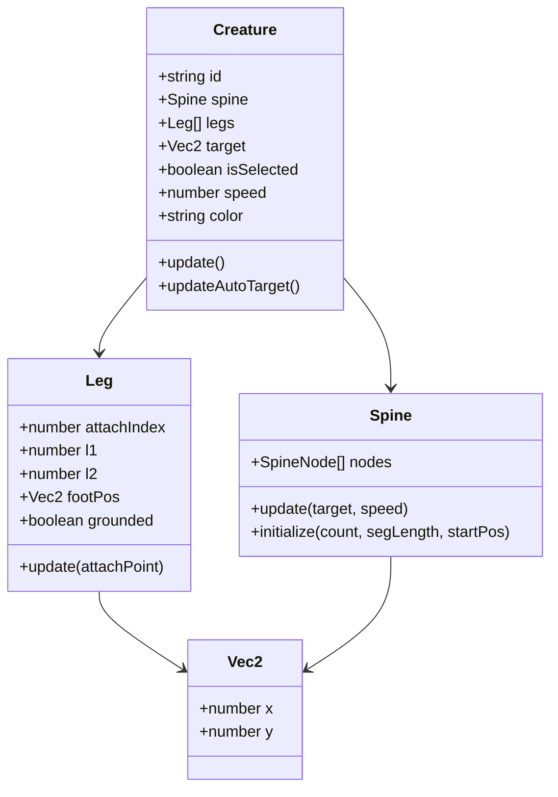
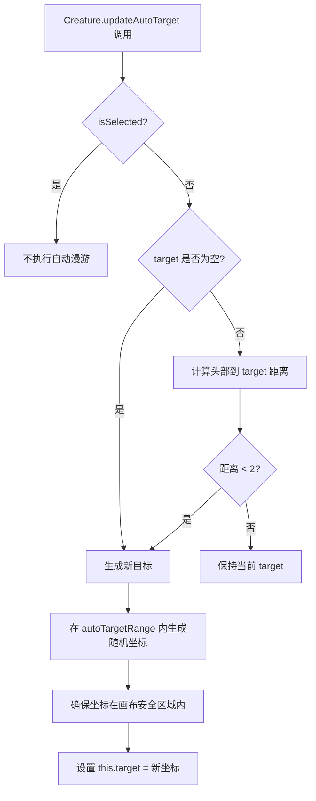
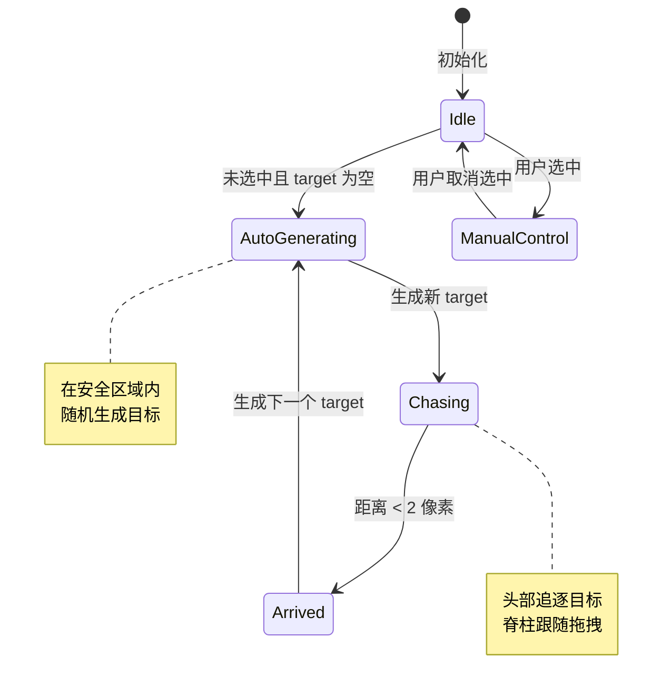
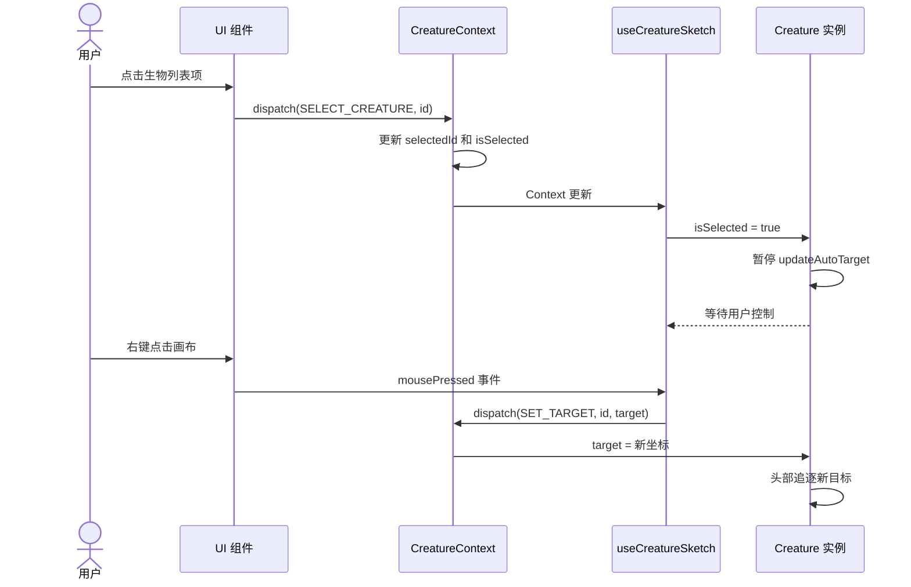
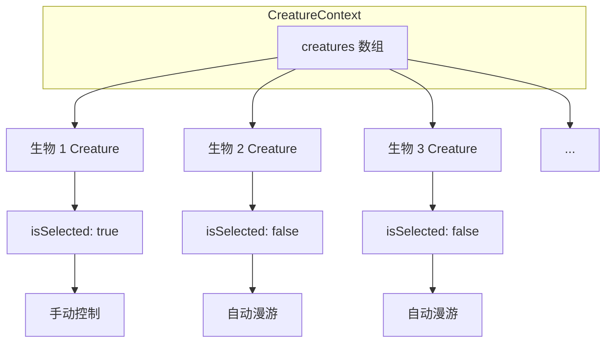

# Creature 行为编排与自动漫游

## 1. Creature 类职责

Creature 类是生物引擎的核心编排类，负责组合脊柱和腿部对象，协调每帧的行为更新。

### 1.1 类结构图



### 1.2 属性定义

| 属性 | 类型 | 说明 |
| --- | --- | --- |
| id | string | 生物唯一标识 |
| spine | Spine | 脊柱对象实例 |
| legs | Leg[] | 腿部对象数组 |
| target | Vec2 \| null | 当前目标点坐标 |
| isSelected | boolean | 是否被用户选中 |
| speed | number | 头部追逐速度 |
| color | string | 生物颜色（#ffffff 格式） |

## 2. 每帧更新完整流程

### 2.1 主更新流程图

```mermaid
flowchart TD
    A[Creature.update 每帧调用] --> B{isSelected?}
    B -->|是| C[使用用户设置的 target]
    B -->|否| D[updateAutoTarget 自动生成随机目标]
    D --> E{target 为空 或 已到达?}
    E -->|是| F[在 autoTargetRange 内生成随机 target]
    E -->|否| G[保持当前 target]
    F --> H
    G --> H
    C --> H[Spine.update(target, speed)]
    H --> I[脊柱头部追逐目标点]
    I --> J[脊柱距离约束迭代 constraintIterations 次]
    J --> K[遍历所有 legs 调用 leg.update]
    K --> L[每条腿执行抬脚检测]
    L --> M[每条腿执行 IK 求解]
    M --> N[更新完成]
```

### 2.2 流程说明

1. **目标确定**：根据 isSelected 状态决定使用用户设置目标还是自动生成目标
2. **脊柱更新**：调用 Spine.update 执行头部追逐和距离约束
3. **腿部更新**：遍历所有腿部，依次执行抬脚检测和 IK 求解
4. **渲染准备**：更新完成后，所有节点和关节位置已就绪，可传递给渲染层

## 3. 自动漫游机制

### 3.1 漫游触发条件

当生物同时满足以下条件时，触发自动目标生成：

- isSelected 为 false（未被用户选中）
- target 为空（null）
- 或头部已到达当前目标（距离 < 2 像素）

### 3.2 自动漫游流程图



### 3.3 状态转换图



### 3.4 目标生成策略

| 策略 | 说明 |
| --- | --- |
| 随机生成 | 在 autoTargetRange 范围内随机选择坐标点 |
| 安全区域 | 确保目标点不会超出画布边界，避免生物被裁剪 |
| 范围限制 | autoTargetRange 为四元素元组 [xMin, yMin, xMax, yMax] |

## 4. 手动控制与自动漫游切换

### 4.1 切换条件

| 当前状态 | 触发事件 | 新状态 |
| --- | --- | --- |
| 自动漫游 | 用户选中该生物 | 手动控制 |
| 手动控制 | 用户取消选中 | 自动漫游 |
| 自动漫游 | 无事件 | 继续自动漫游 |
| 手动控制 | 用户右键设置新目标 | 手动控制（目标更新） |

### 4.2 切换时序图



## 5. Creature 类方法定义

### 5.1 公共方法

| 方法 | 输入 | 输出 | 说明 |
| --- | --- | --- | --- |
| update() | 无 | 无 | 每帧调用，执行完整更新流程 |
| updateAutoTarget() | 无 | 无 | 自动生成随机目标点 |
| initialize(config) | CreatureConfig | 无 | 根据配置初始化脊柱和腿部 |

### 5.2 私有方法

| 方法 | 输入 | 输出 | 说明 |
| --- | --- | --- | --- |
| hasArrived(target) | 目标点 | boolean | 判断头部是否已到达目标 |
| getHeadPosition() | 无 | Vec2 | 获取头部节点当前位置 |

## 6. 多生物协同管理

### 6.1 生物集合维护



### 6.2 协同规则

| 规则 | 说明 |
| --- | --- |
| 唯一选中 | 同时只能有一个生物被选中（selectedId 为单值） |
| 独立漫游 | 未选中的生物各自独立执行自动漫游，互不干扰 |
| 并行更新 | 每帧依次调用所有生物的 update 方法 |
| 资源释放 | 删除生物时同步清理 p5 中的对应实例引用 |

## 7. 边界条件处理

### 7.1 目标点边界

| 情况 | 处理方式 |
| --- | --- |
| target 为 null | 自动漫游机制触发 |
| target 超出画布 | 生成时限制在 autoTargetRange 内 |
| 移动中目标被修改 | 下一帧立即使用新目标 |

### 7.2 生物数量边界

| 情况 | 处理方式 |
| --- | --- |
| creatures 为空数组 | 画布不渲染任何生物 |
| 生物数量 = 1 | 正常更新 |
| 生物数量 > 20 | 建议采用对象池模式优化性能 |

### 7.3 配置参数边界

| 参数 | 最小值 | 最大值 | 越界处理 |
| --- | --- | --- | --- |
| spineCount | 3 | 30 | 钳制到有效范围 |
| segLength | 10 | 50 | 钳制到有效范围 |
| legCount | 0 | 8 | 钳制到有效范围 |
| speed | 1 | 10 | 钳制到有效范围 |

## 8. 算法复杂度分析

### 8.1 时间复杂度

| 操作 | 复杂度 | 说明 |
| --- | --- | --- |
| updateAutoTarget | O(1) | 简单条件判断和随机数生成 |
| Spine.update | O(n * k) | n 为节点数，k 为迭代次数 |
| Leg.updateAll | O(m) | m 为腿部数量 |
| Creature.update | O(n * k + m) | 完整更新流程 |
| 所有生物更新 | O(N *(n* k + m)) | N 为生物数量 |

### 8.2 空间复杂度

| 数据结构 | 复杂度 | 说明 |
| --- | --- | --- |
| 单个 Creature | O(n + m) | 脊柱节点 + 腿部对象 |
| 所有 Creature | O(N * (n + m)) | N 为生物数量 |

## 9. 测试用例设计

### 9.1 基础功能测试

| 测试项 | 输入 | 预期输出 |
| --- | --- | --- |
| 初始化 | 完整 CreatureConfig | 脊柱和腿部正常初始化 |
| 手动控制 | isSelected=true, target=(100,100) | 头部追逐 (100,100) |
| 自动漫游 | isSelected=false, target=null | 生成随机目标并开始追逐 |
| 到达判定 | target=(100,100), dist=1.5 | 生成下一个随机目标 |

### 9.2 边界条件测试

| 测试项 | 输入 | 预期输出 |
| --- | --- | --- |
| 空生物集合 | creatures=[] | 不报错，不渲染 |
| 零腿部 | legCount=0 | 不调用 IK，正常更新脊柱 |
| 目标超出范围 | target 超出画布 | 生成时限制在安全区域 |
| 多生物并发 | N=10 个生物 | 所有生物独立更新，互不干扰 |

### 9.3 状态切换测试

| 测试项 | 输入 | 预期输出 |
| --- | --- | --- |
| 选中切换 | isSelected: false → true | 暂停自动漫游 |
| 取消选中 | isSelected: true → false | 恢复自动漫游 |
| 目标更新 | 右键设置新 target | 下一帧使用新目标 |
