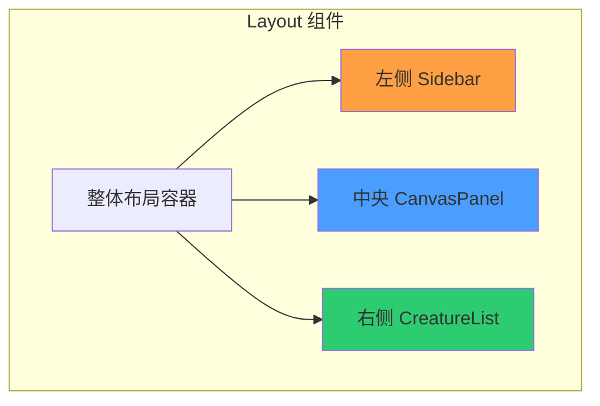
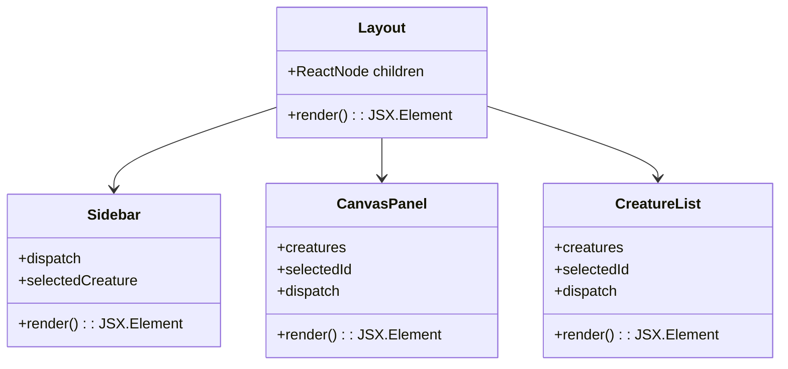
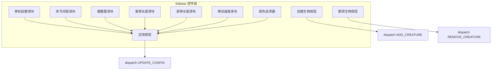
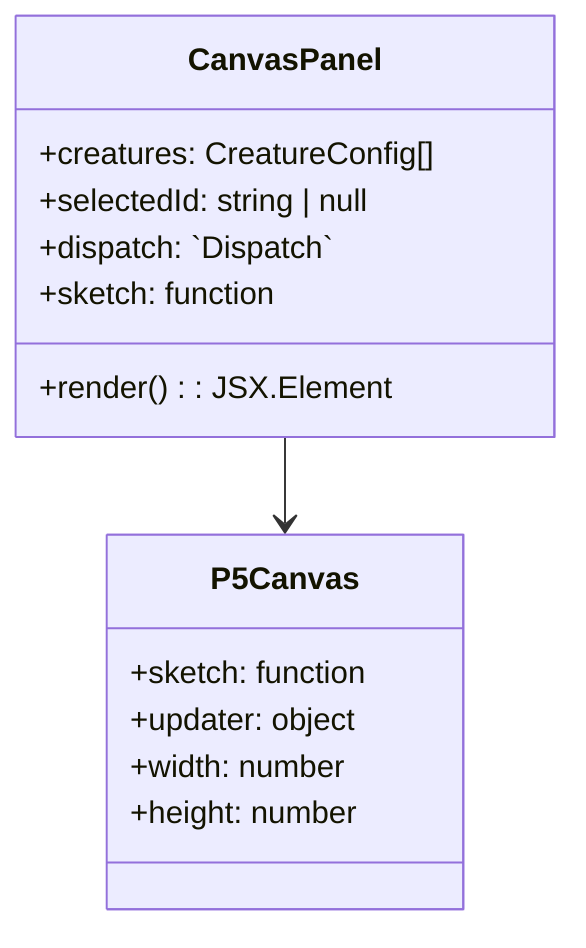
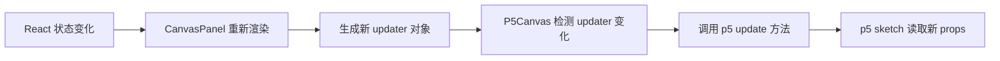
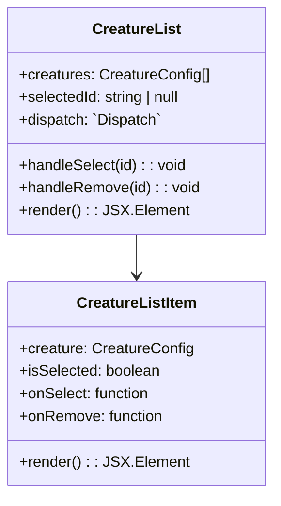
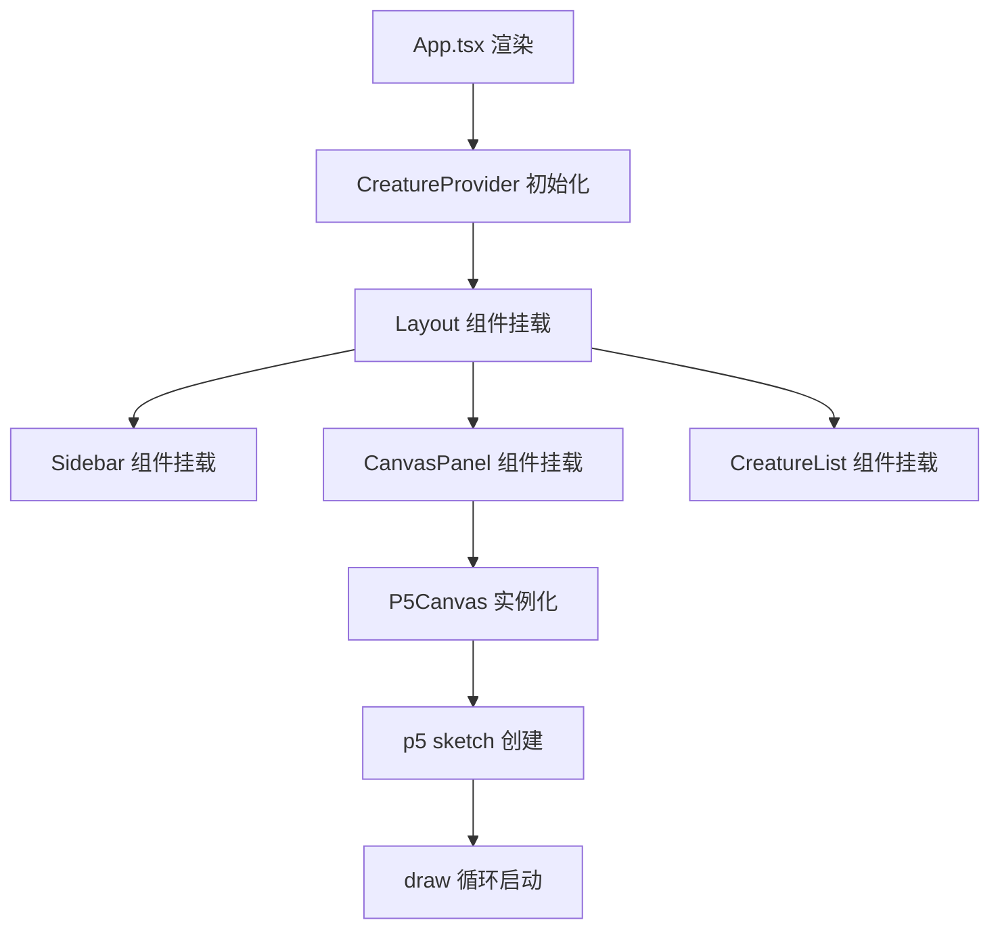
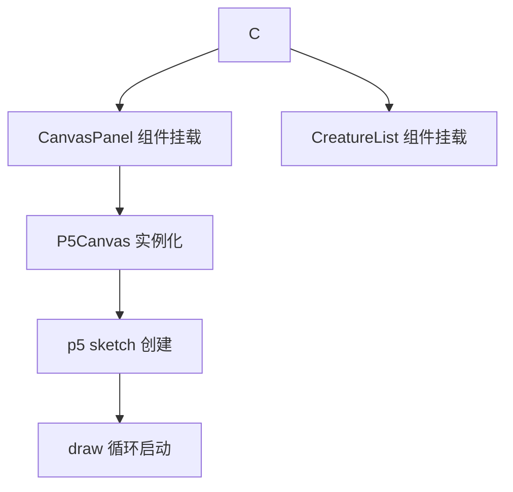
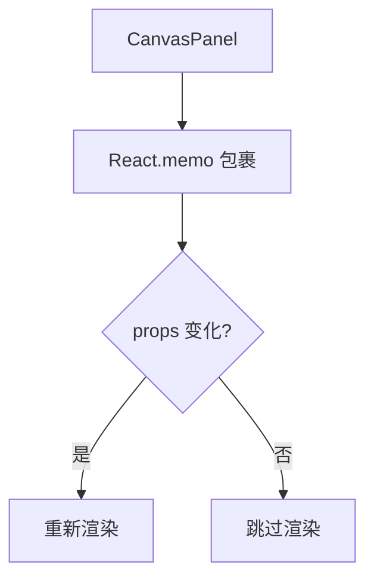

# UI 组件设计

## 1. 整体布局架构

### 1.1 三列布局结构

### 1.2 布局尺寸分配

| 区域 | 宽度占比 | 最小宽度 | 说明 |
| --- | --- | --- | --- |
| 左侧 Sidebar | 20% | 250px | 配置面板，包含滑块和按钮 |
| 中央 CanvasPanel | 60% | 500px | p5 画布容器，主要展示区域 |
| 右侧 CreatureList | 20% | 200px | 生物列表，支持选中与删除 |

### 1.3 响应式行为

| 屏幕宽度 | 布局策略 |
| --- | --- |
| ≥ 1200px | 三列并排布局 |
| 768px ~ 1199px | 左侧栏折叠，中央和右侧并排 |
| < 768px | 单列堆叠布局，通过标签页切换 |

## 2. Layout 组件

### 2.1 组件职责

- 提供整体三列布局容器
- 使用 CSS Grid 或 Flexbox 实现响应式布局
- 将三个子组件作为子节点渲染

### 2.2 组件结构

### 2.3 Props 定义

| 属性 | 类型 | 必填 | 说明 |
| --- | --- | --- | --- |
| children | ReactNode | 否 | 自定义子节点（可选） |

**注**：Layout 组件本身不接收业务 props，通过 Context 获取状态。

## 3. Sidebar 组件

### 3.1 组件职责

- 显示当前选中生物的配置参数
- 提供滑块控件调整数值参数
- 提供按钮执行创建、删除、应用等操作
- 将用户输入通过 dispatch 派发到状态管理层

### 3.2 控件列表

### 3.3 控件参数表

| 控件 | 绑定参数 | 最小值 | 最大值 | 步长 | 单位 |
| --- | --- | --- | --- | --- | --- |
| 脊柱段数 | spineCount | 3 | 30 | 1 | 个 |
| 体节间距 | segLength | 10 | 50 | 1 | 像素 |
| 腿数量 | legCount | 0 | 8 | 1 | 个 |
| 股骨长度 | legSegments[0] | 5 | 50 | 1 | 像素 |
| 胫骨长度 | legSegments[1] | 5 | 50 | 1 | 像素 |
| 移动速度 | speed | 1 | 10 | 0.5 | 像素/帧 |
| 颜色 | color | #000000 | #ffffff | - | 十六进制 |

### 3.4 状态管理

| 状态 | 类型 | 说明 |
| --- | --- | --- |
| 当前编辑值 | CreatureConfig | 用户正在修改的配置（未应用） |
| 已应用值 | CreatureConfig | 从 Context 获取的当前生效配置 |
| 是否有未应用修改 | boolean | 标记用户是否修改了参数但未点击应用 |

### 3.5 Props 定义

| 属性 | 类型 | 必填 | 说明 |
| --- | --- | --- | --- |
| dispatch | `Dispatch<CreatureAction>` | 是 | Action 派发函数 |
| selectedCreature | CreatureConfig \| null | 是 | 当前选中的生物配置 |

## 4. CanvasPanel 组件

### 4.1 组件职责

- 容纳 @p5-wrapper/react 的 P5Canvas 组件
- 将 React 状态转换为 p5 sketch prop
- 使用 updater 机制同步状态到 p5
- 设置画布尺寸和样式

### 4.2 组件结构

### 4.3 Props 定义

| 属性 | 类型 | 必填 | 说明 |
| --- | --- | --- | --- |
| creatures | CreatureConfig[] | 是 | 生物配置数组 |
| selectedId | string \| null | 是 | 当前选中生物 ID |
| dispatch | `Dispatch<CreatureAction>` | 是 | Action 派发函数 |

### 4.4 sketch prop 结构

| 属性 | 说明 |
| --- | --- |
| creatures | 从 Context 获取的生物配置数组 |
| selectedId | 从 Context 获取的当前选中 ID |
| dispatch | 用于派发 Action 的派发函数 |

### 4.5 updater 机制

## 5. CreatureList 组件

### 5.1 组件职责

- 展示所有生物的列表
- 高亮显示当前选中的生物
- 支持点击选中生物
- 支持点击删除生物

### 5.2 组件结构

### 5.4 Props 定义

| 元素 | 说明 |
| --- | --- |
| 生物 ID 显示 | 显示生物的唯一标识 |
| 生物参数摘要 | 显示脊柱段数、腿数量等关键参数 |
| 选中状态指示 | 通过颜色或边框高亮显示选中状态 |
| 删除按钮 | 点击删除该生物 |

| 属性 | 类型 | 必填 | 说明 |
| --- | --- | --- | --- |
| creatures | CreatureConfig[] | 是 | 生物配置数组 |
| selectedId | string \| null | 是 | 当前选中生物 ID |
| dispatch | `Dispatch<CreatureAction>` | 是 | Action 派发函数 |

## 6. 深色主题设计

### 6.1 Tailwind 色板配置

| 色板名称 | 色值 | 用途 |
| --- | --- | --- |
| surface | #0a0a0a | 全局背景色 |
| panel | #1a1a1a | 面板背景色 |
| panel-hover | #2a2a2a | 面板悬停背景色 |
| accent | #4a9eff | 强调色、选中状态色 |
| text-primary | #ffffff | 主要文字色 |
| text-secondary | #a0a0a0 | 次要文字色 |
| border | #333333 | 边框颜色 |

### 6.2 组件样式分配

| 组件 | 背景色 | 文字色 | 边框 |
| --- | --- | --- | --- |
| Layout | surface | - | - |
| Sidebar | panel | text-primary | border |
| CanvasPanel | #000000 | - | border |
| CreatureList | panel | text-primary | border |
| CreatureListItem | panel | text-primary | border |
| CreatureListItem (选中) | panel + accent 边框 | accent | accent |

## 7. 组件生命周期

### 7.1 挂载流程

### 7.2 卸载流程

### 7.3 更新触发条件

| 组件 | 更新触发条件 |
| --- | --- |
| Sidebar | selectedId 变化或生物配置变化 |
| CanvasPanel | creatures 数组变化或 selectedId 变化 |
| CreatureList | creatures 数组变化或 selectedId 变化 |
| CreatureListItem | 对应生物的 isSelected 状态变化 |

## 8. 组件优化策略

### 8.1 React.memo 应用

| 组件 | 是否使用 memo | 原因 |
| --- | --- | --- |
| Layout | 否 | 布局稳定，不需要 |
| Sidebar | 是 | 仅在 selectedId 变化时更新 |
| CanvasPanel | 是 | 避免不必要的重渲染 |
| CreatureList | 是 | 仅在 creatures 变化时更新 |
| CreatureListItem | 是 | 仅在对应生物状态变化时更新 |

### 8.2 useCallback 应用

| 回调函数 | 依赖项 | 优化效果 |
| --- | --- | --- |
| handleSelect | dispatch | 避免每次渲染创建新函数 |
| handleRemove | dispatch | 避免每次渲染创建新函数 |
| sketch 函数 | creatures, selectedId, dispatch | 避免 p5 实例重建 |

## 9. 测试用例设计

### 9.1 渲染测试

| 测试项 | 输入 | 预期输出 |
| --- | --- | --- |
| Layout 渲染 | 无子节点 | 三列布局容器正确渲染 |
| Sidebar 渲染 | selectedCreature = null | 显示默认空状态提示 |
| CanvasPanel 渲染 | creatures = [] | 空画布渲染，无生物 |
| CreatureList 渲染 | creatures = [] | 显示空列表提示 |

### 9.2 交互测试

| 测试项 | 操作 | 预期输出 |
| --- | --- | --- |
| Sidebar 滑块调整 | 拖动脊柱段数滑块 | 显示新数值，不立即应用 |
| Sidebar 应用按钮 | 点击应用按钮 | dispatch UPDATE_CONFIG Action |
| CreatureList 点击 | 点击生物列表项 | dispatch SELECT_CREATURE Action |
| CreatureList 删除 | 点击删除按钮 | dispatch REMOVE_CREATURE Action |

### 9.3 样式测试

| 测试项 | 操作 | 预期输出 |
| --- | --- | --- |
| 深色主题 | 查看页面 | 全局背景为 #0a0a0a |
| 选中高亮 | 选中生物 | 列表项边框和文字变为 accent 色 |
| 悬停效果 | 鼠标悬停按钮 | 背景色变为 panel-hover |
