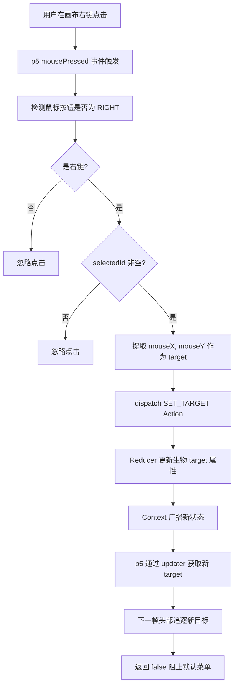
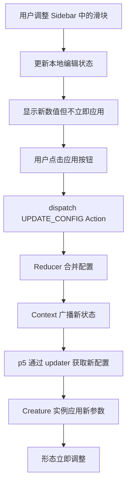
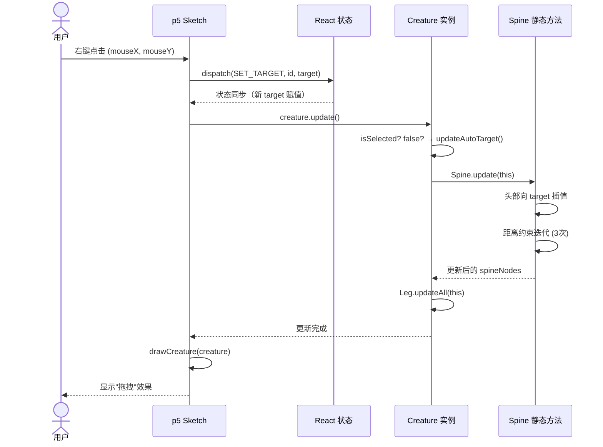

# 交互机制设计

## 1. 交互模式总览

系统支持两种主要交互模式：手动控制和自动漫游。

| 交互模式 | 触发条件 | 行为特征 | 适用场景 |
| --- | --- | --- | --- |
| 手动控制 | 用户选中生物并右键点击 | 生物跟随用户设置的目标点移动 | 精确控制生物运动轨迹 |
| 自动漫游 | 生物未被选中 | 生物自动生成随机目标并移动 | 展示程序化动画效果 |

## 2. 手动控制交互

### 2.1 触发条件

用户在画布区域执行右键点击操作，且当前存在选中的生物。

### 2.2 响应流程图



### 2.3 事件处理时序图

```mermaid
sequenceDiagram
    actor 用户
    participant Canvas as p5 画布
    participant Hk as useCreatureSketch
    participant Ctx as CreatureContext
    participant Rdc as Reducer
    participant Cr as Creature 实例
    
    用户 ->> Canvas: 右键点击 (mouseX, mouseY)
    Canvas ->> Hk: mousePressed 事件
    Hk ->> Hk: 检测 button === RIGHT
    Hk ->> Hk: 检测 selectedId !== null
    Hk ->> Ctx: dispatch(SET_TARGET, selectedId, {x: mouseX, y: mouseY})
    Ctx ->> Rdc: (state, action)
    Rdc ->> Rdc: 更新对应生物的 target
    Rdc ->> Ctx: 返回新 state
    Ctx ->> Ctx: 广播状态更新
    Ctx ->> Hk: updater 机制同步
    Hk ->> Cr: target 更新生效
    Cr ->> Cr: 头部追逐新目标
    Hk ->> Canvas: return false（阻止默认菜单）
```mermaid

### 2.4 右键上下文阻止

| 方法 | 说明 |
| --- | --- |
| 返回 false | mousePressed 函数返回 false |
| 效果 | 阻止浏览器默认右键菜单弹出 |
| 必要性 | 确保用户交互不被系统菜单打断 |

## 3. 选中生物的交互

### 3.1 选中方式一：右侧生物列表点击

```mermaid
flowchart TD
    A[用户点击 CreatureList 中的生物条目] --> B[CreatureListItem 触发 onClick]
    B --> C[dispatch SELECT_CREATURE Action]
    C --> D[Reducer 处理 Action]
    D --> E[遍历 creatures 数组]
    E --> F[设置对应 id 的 isSelected = true]
    F --> G[其他生物 isSelected = false]
    G --> H[更新 selectedId = 传入的 id]
    H --> I[Context 广播新状态]
    I --> J[Sidebar 显示该生物配置]
    I --> K[CanvasPanel 启用手动控制]
```text

### 3.2 选中方式二：画布上点击检测（可选扩展）

```mermaid
flowchart TD
    A[用户左键点击画布] --> B[计算鼠标到各生物头部节点的距离]
    B --> C[选择距离最近的生物]
    C --> D{距离 < 阈值?}
    D -->|是| E[dispatch SELECT_CREATURE]
    D -->|否| F[取消选中]
    E --> G[生物被选中]
    F --> H[无生物选中]
```

**实现说明**：

- 该方式为可选扩展，非核心功能
- 需要计算鼠标到每个生物头部节点的欧氏距离
- 选择距离最小的生物作为选中对象
- 距离阈值建议设置为 30 像素

### 3.3 高亮反馈机制

| 反馈位置 | 反馈方式 | 视觉表现 |
| --- | --- | --- |
| p5 画布 | 额外轮廓或颜色变化 | 选中生物绘制发光边框或颜色变亮 |
| CreatureList | 列表项高亮 | 边框和文字变为 accent 色（#4a9eff） |
| Sidebar | 显示该生物配置 | 滑块和按钮显示当前生物参数 |

## 4. 参数调整的交互

### 4.1 操作流程



### 4.2 参数同步流程

| 步骤 | 操作 | 数据流 |
| --- | --- | --- |
| 1 | 用户调整滑块 | UI 控件 → 本地状态 |
| 2 | 用户点击应用 | 本地状态 → dispatch Action |
| 3 | Reducer 处理 | Action → 新配置 |
| 4 | Context 广播 | 新配置 → 所有订阅者 |
| 5 | p5 同步 | updater → Creature 实例 |
| 6 | 形态调整 | 新参数 → 视觉效果变化 |

### 4.3 参数调整约束

| 参数 | 调整范围 | 越界处理 |
| --- | --- | --- |
| spineCount | 3~30 | 滑块限制范围，不允许越界 |
| segLength | 10~50 | 滑块限制范围 |
| legCount | 0~8 | 滑块限制范围 |
| speed | 1~10 | 滑块限制范围 |

## 5. 多生物协同管理

### 5.1 生物集合维护

```mermaid
graph TD
    subgraph "CreatureContext 状态"
        A[creatures 数组]
        B[selectedId]
    end
    
    A --> C1[生物 1: isSelected=true]
    A --> C2[生物 2: isSelected=false]
    A --> C3[生物 3: isSelected=false]
    
    B --> D[指向生物 1 的 ID]
    
    C1 --> E1[手动控制模式]
    C2 --> E2[自动漫游模式]
    C3 --> E3[自动漫游模式]
```mermaid

### 5.2 操作影响范围

| 操作 | 影响范围 | 说明 |
| --- | --- | --- |
| ADD_CREATURE | 全局 | 添加新生物到数组末尾 |
| REMOVE_CREATURE | 全局 + 选中状态 | 删除生物，若删除的是选中生物则取消选中 |
| SELECT_CREATURE | 全局 | 更新所有生物的 isSelected 状态 |
| SET_TARGET | 单个生物 | 只更新指定生物的 target |
| UPDATE_CONFIG | 单个生物 | 只更新指定生物的配置 |

### 5.3 自动漫游协同

| 规则 | 说明 |
| --- | --- |
| 独立漫游 | 每个未选中生物独立生成目标和移动 |
| 互不干扰 | 生物之间无碰撞检测和避让逻辑 |
| 并行更新 | 每帧依次调用所有生物的 update 方法 |
| 视觉协同 | 多生物同时运动，形成自然生态效果 |

## 6. 状态切换交互

### 6.1 完整状态机

```mermaid
stateDiagram-v2
    [*] --> 无生物: 初始化
    
    无生物 --> 单个生物自动漫游: 添加第一个生物
    单个生物自动漫游 --> 单个生物手动控制: 用户选中
    单个生物手动控制 --> 单个生物自动漫游: 用户取消选中
    
    单个生物自动漫游 --> 多生物混合: 添加更多生物
    单个生物手动控制 --> 多生物混合: 添加更多生物
    
    多生物混合 --> 多生物混合: 切换选中生物
    多生物混合 --> 单个生物手动控制: 删除其他生物
    多生物混合 --> 无生物: 删除所有生物
    
    note right of 单个生物自动漫游
        isSelected = false
        自动生成随机目标
    end note
    
    note right of 单个生物手动控制
        isSelected = true
        用户右键设置目标
    end note

    note right of 多生物混合
        一个生物手动控制
        其他生物自动漫游
    end note
```

### 6.2 切换事件表

| 当前状态 | 触发事件 | 新状态 | 受影响生物 |
| --- | --- | --- | --- |
| 无生物 | ADD_CREATURE | 单个生物自动漫游 | 新生物 |
| 单个生物自动漫游 | SELECT_CREATURE | 单个生物手动控制 | 该生物 |
| 单个生物手动控制 | SELECT_CREATURE(null) | 单个生物自动漫游 | 该生物 |
| 多生物混合 | SELECT_CREATURE(新 ID) | 多生物混合 | 原选中和新选中生物 |
| 任何状态 | REMOVE_CREATURE(选中 ID) | 状态可能降级 | 被删除生物 |

## 7. 交互时序图

### 7.1 头部节点追逐目标点



## 8. 交互边界条件

### 7.2 自动漫游目标生成

```mermaid
sequenceDiagram
    actor 系统
    participant P5S as p5 draw 循环
    participant Creature as Creature 实例
    
    系统 ->> P5S: 每帧调用 draw()
    P5S ->> Creature: creature.update()
    Creature ->> Creature: isSelected? false
    Creature ->> Creature: updateAutoTarget()
    alt 目标为空 或 已到达
        Creature ->> Creature: 生成随机坐标作为 target
        Creature ->> Creature: this.target = random(x,y)
    else 目标存在且未到达
        Creature ->> Creature: 头部继续追逐
    end
    Creature ->> Creature: 脊柱距离约束 + IK 计算
    Creature -->> P5S: 更新完成
    P5S ->> P5S: 绘制生物
```mermaid

## 8. 交互边界条件

### 8.1 画布边界

| 情况 | 处理方式 |
| --- | --- |
| 右键点击超出画布 | p5 不触发 mousePressed |
| 目标点生成在画布外 | 自动漫游限制在 autoTargetRange 内 |
| 生物移动到画布边缘 | 脊柱和腿部继续运动，可能被裁剪 |

### 8.2 并发操作

| 情况 | 处理方式 |
| --- | --- |
| 快速连续右键点击 | 每次点击都设置新 target，最后一次生效 |
| 点击同时删除生物 | 若删除的是选中生物，点击被忽略 |
| 参数调整中删除生物 | Sidebar 显示空状态，等待重新选中 |

## 9. 测试用例设计

### 9.1 手动控制测试

| 测试项 | 操作 | 预期输出 |
| --- | --- | --- |
| 右键设置目标 | 选中生物后右键点击 | 生物头部向点击位置移动 |
| 左键点击 | 左键点击画布 | 不触发任何操作 |
| 未选中时右键 | 无选中生物时右键点击 | 不触发任何操作 |
| 连续设置目标 | 快速连续右键点击 | 生物追逐最后设置的目标 |

### 9.2 选中交互测试

| 测试项 | 操作 | 预期输出 |
| --- | --- | --- |
| 列表点击选中 | 点击 CreatureList 中的生物 | 该生物高亮，Sidebar 显示配置 |
| 取消选中 | 点击已选中的生物 | 该生物取消高亮，进入自动漫游 |
| 切换选中 | 点击另一个生物 | 原生物取消选中，新生物被选中 |

### 9.3 参数调整测试

| 测试项 | 操作 | 预期输出 |
| --- | --- | --- |
| 调整滑块 | 拖动脊柱段数滑块 | 显示新数值，形态不变 |
| 点击应用 | 点击应用按钮 | 形态立即调整 |
| 超出范围 | 尝试设置超出范围的值 | 滑块限制在有效范围内 |
