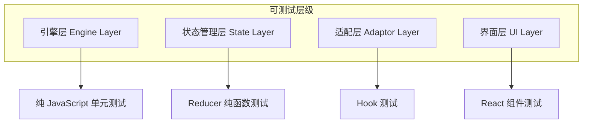
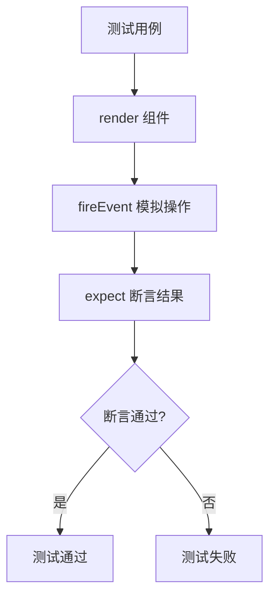
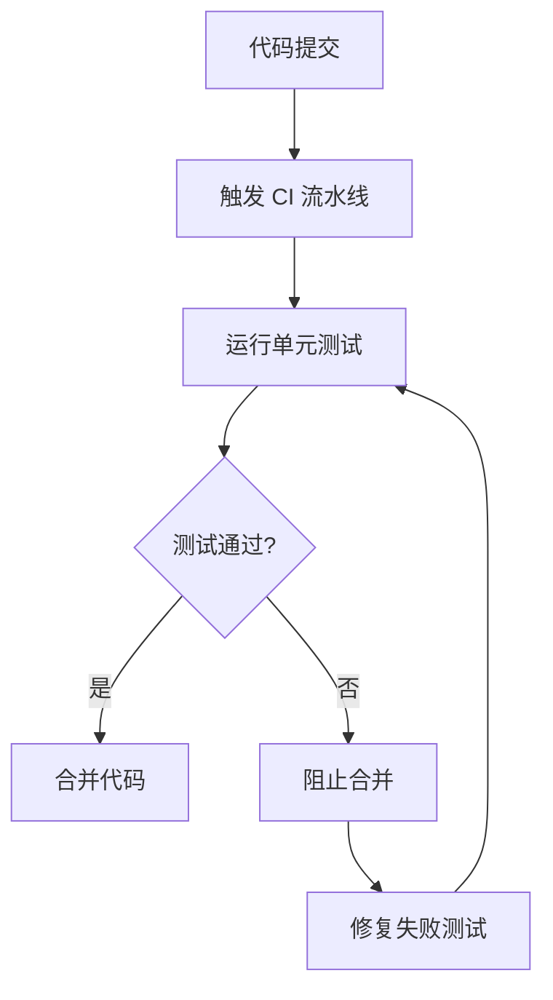
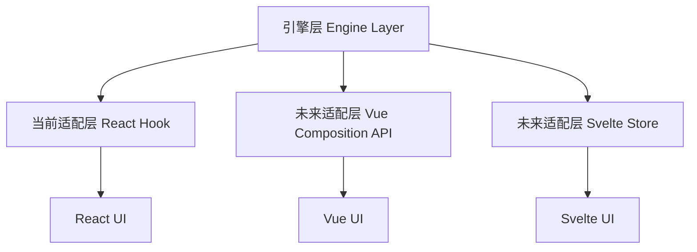

# 测试与可扩展性

## 1. 测试架构

### 1.1 模块解耦带来的测试优势



### 1.2 关键测试用例

| 测试场景 | 测试方法 | 预期结果 |
| --- | --- | --- |
| 引擎层 | Jest / Vitest | 纯 JavaScript 单元测试 |
| 状态管理层 | Jest / Vitest | Reducer 纯函数测试 |
| 适配层 | React Testing Library + Jest | Hook 测试 |
| 界面层 | React Testing Library | React 组件测试 |

## 2. 引擎层测试

### 2.1 Spine 类测试

#### 2.1.1 距离约束正确性测试

| 测试项 | 输入 | 预期输出 |
| --- | --- | --- |
| 初始化节点 | spineCount=5, segLength=20 | 5 个节点水平排列，间距 20 像素 |
| 头部追逐 | target=(100, 100), speed=5 | 头部每帧向 (100, 100) 移动最多 5 像素 |
| 到达判定 | target=(100, 100), dist=0.5 | 头部固定在 (100, 100) |
| 约束求解 | 拖拽节点 0 | 节点 1~4 跟随移动，间距保持 20 像素 |
| 多次迭代 | iterations=3 | 约束误差小于 1 像素 |

#### 2.1.2 边界条件测试

| 测试项 | 输入 | 预期输出 |
| --- | --- | --- |
| 最小节点数 | spineCount=2 | 正常初始化，约束有效 |
| 零间距 | segLength=0 | 抛出异常或防御性处理 |
| 空目标 | target=null | 跳过头部追逐，不崩溃 |
| 节点重合 | 两节点位置相同 | 跳过该节点，避免除零异常 |

### 2.2 Leg 类测试

#### 2.2.1 IK 关节角度输出范围测试

| 测试项 | 输入 | 预期输出 |
| --- | --- | --- |
| 正常 IK 求解 | A=(0,0), F=(30,0), l1=20, l2=15 | 中间关节坐标有效 |
| 目标超出范围 | dist >= l1 + l2 | 脚部约束在可达范围内 |
| 浮点误差 | cosθ = 1.0001 | 钳制到 1，acos 正常返回 |
| 零骨骼长度 | l1=0, l2=0 | 抛出异常或防御性处理 |

#### 2.2.2 抬脚逻辑测试

| 测试项 | 输入 | 预期输出 |
| --- | --- | --- |
| 抬脚触发 | dist > liftThreshold | grounded = false |
| 落地触发 | dist < liftThreshold * 0.3 | grounded = true |
| 状态保持 | liftThreshold * 0.3 ≤ dist ≤ liftThreshold | grounded 状态不变 |

### 2.3 Creature 类测试

#### 2.3.1 目标追逐距离计算测试

| 测试项 | 输入 | 预期输出 |
| --- | --- | --- |
| 手动控制 | isSelected=true, target=(100,100) | 头部追逐 (100,100) |
| 自动漫游 | isSelected=false, target=null | 生成随机目标 |
| 到达后漫游 | dist < 2 | 生成下一个随机目标 |

#### 2.3.2 多腿协同测试

| 测试项 | 输入 | 预期输出 |
| --- | --- | --- |
| 零腿部 | legCount=0 | 不调用 IK，正常更新脊柱 |
| 单腿 | legCount=1 | 单腿 IK 计算有效 |
| 多腿 | legCount=4 | 所有腿独立更新，互不干扰 |

## 3. 状态管理层测试

### 3.1 Reducer 纯函数测试

| Action 类型 | 测试项 | 预期输出 |
| --- | --- | --- |
| ADD_CREATURE | 添加新生物 | creatures 数组长度 +1 |
| REMOVE_CREATURE | 删除存在的生物 | creatures 数组移除对应 id |
| REMOVE_CREATURE | 删除不存在的生物 | 状态不变 |
| SELECT_CREATURE | 选中生物 | 对应生物 isSelected=true，其他=false |
| SELECT_CREATURE | 取消选中 | selectedId=null，所有 isSelected=false |
| SET_TARGET | 设置目标 | 对应生物 target 更新 |
| UPDATE_CONFIG | 更新配置 | 对应生物配置合并更新 |

### 3.2 并发 Action 测试

| 测试项 | 输入 | 预期输出 |
| --- | --- | --- |
| 连续派发 | ADD_CREATURE × 3 | creatures 数组长度 +3 |
| 交叉派发 | SELECT_CREATURE + SET_TARGET | 按顺序依次处理 |
| 空状态派发 | 任何 Action | 正常处理，不报错 |

## 4. 界面层测试

### 4.1 React 组件测试

#### 4.1.1 渲染测试

| 组件 | 测试项 | 预期输出 |
| --- | --- | --- |
| Sidebar | selectedCreature=null | 显示空状态提示 |
| CanvasPanel | creatures=[] | 空画布渲染 |
| CreatureList | creatures=[] | 显示空列表提示 |
| CreatureList | creatures=[1,2,3] | 显示 3 个列表项 |

#### 4.1.2 交互测试

| 组件 | 操作 | 预期输出 |
| --- | --- | --- |
| Sidebar | 拖动滑块 | 显示新数值 |
| Sidebar | 点击应用 | dispatch UPDATE_CONFIG |
| CreatureList | 点击列表项 | dispatch SELECT_CREATURE |
| CreatureList | 点击删除 | dispatch REMOVE_CREATURE |

### 4.2 React Testing Library 模拟



## 5. 参数边界测试

### 5.1 测试用例表

| 参数 | 测试值 | 预期行为 |
| --- | --- | --- |
| spineCount | 2 | 最小有效链，正常执行 |
| spineCount | 31 | 超出范围，钳制到 30 |
| segLength | 0 | 无效参数，防御性处理 |
| segLength | 51 | 超出范围，钳制到 50 |
| legCount | 0 | 正常执行，不调用 IK |
| legCount | 9 | 超出范围，钳制到 8 |
| speed | 0 | 过低，钳制到 1 |
| speed | 11 | 超出范围，钳制到 10 |

### 5.2 边界测试策略

| 策略 | 说明 |
| --- | --- |
| 最小值测试 | 验证参数下限时系统不崩溃 |
| 最大值测试 | 验证参数上限时性能可接受 |
| 越界测试 | 验证越界值被正确钳制 |
| 空值测试 | 验证 null/undefined 处理 |

## 6. 自动化回归测试

### 6.1 测试覆盖率目标

| 层级 | 覆盖率目标 | 说明 |
| --- | --- | --- |
| 引擎层 | ≥ 90% | 核心算法必须充分测试 |
| 状态管理层 | ≥ 95% | Reducer 纯函数易于测试 |
| 适配层 | ≥ 80% | Hook 逻辑测试 |
| 界面层 | ≥ 70% | UI 组件交互测试 |

### 6.2 回归测试流程



## 7. 可扩展性设计

### 7.1 框架可移植性



**可移植性说明**：

- 引擎层纯类没有框架依赖，可轻松移植到其他前端框架
- 只需重新实现适配层（自定义 Hook/函数）
- 核心算法无需修改

### 7.2 未来扩展框架

| 扩展方向 | 实现方式 | 影响范围 |
| --- | --- | --- |
| 新行为模式 | 在 Creature.update 中添加新逻辑 | 仅修改 Creature 类 |
| 新渲染器 | 替换 p5 为 Canvas API 或 WebGL | 仅修改适配层 |
| 新状态管理 | 替换 useReducer 为 Zustand/Redux | 仅修改状态管理层 |
| 多画布支持 | 创建多个 P5Canvas 实例 | 仅修改 UI 层 |

### 7.3 扩展点设计

| 扩展点 | 位置 | 扩展方式 |
| --- | --- | --- |
| 脊柱行为 | Spine 类 | 添加新的约束算法 |
| 腿部 IK | Leg 类 | 支持三关节或更多 |
| 目标生成 | Creature.updateAutoTarget | 实现智能路径规划 |
| 渲染样式 | p5 drawCreature | 添加纹理或 3D 效果 |

## 8. 测试用例管理

### 8.1 测试文件结构

```text
tests/
├── engine/
│   ├── Spine.test.ts      # 脊柱算法测试
│   ├── Leg.test.ts        # IK 肢体测试
│   └── Creature.test.ts   # 生物编排测试
├── state/
│   └── reducer.test.ts    # Reducer 测试
├── hooks/
│   └── useCreatureSketch.test.ts  # Hook 测试
└── components/
    ├── Sidebar.test.tsx   # 侧边栏测试
    ├── CanvasPanel.test.tsx  # 画布测试
    └── CreatureList.test.tsx  # 列表测试
```

### 8.2 测试命名规范

| 测试类型 | 命名模式 | 示例 |
| --- | --- | --- |
| 单元测试 | `describe('方法名')` | `describe('Spine.update')` |
| 测试用例 | `it('预期行为')` | `it('头部向目标点移动')` |
| 边界测试 | `it('边界条件描述')` | `it('节点重合时不崩溃')` |

## 9. 测试执行

### 9.1 测试命令

| 命令 | 说明 |
| --- | --- |
| `npm test` | 运行所有测试 |
| `npm test -- --watch` | 监听模式，开发时使用 |
| `npm test -- --coverage` | 生成覆盖率报告 |
| `npm test -- Spine` | 只运行 Spine 相关测试 |

### 9.2 测试通过标准

| 标准 | 要求 |
| --- | --- |
| 所有测试通过 | 0 failures |
| 覆盖率达标 | 引擎层 ≥ 90% |
| 边界覆盖 | 所有边界条件有测试用例 |
| 回归通过 | 修改后所有原有测试仍通过 |
